# 1. Product Introduction

## 1.1 Product Safety

1\. This product contain tiny pins, please keep them out of reach of children.

2\. Please operate according to the requirements of tutorials. Improper operation may cause parts to overheat damage. Pay attention to electrical safety.

---------------

## 1.2 Introduction

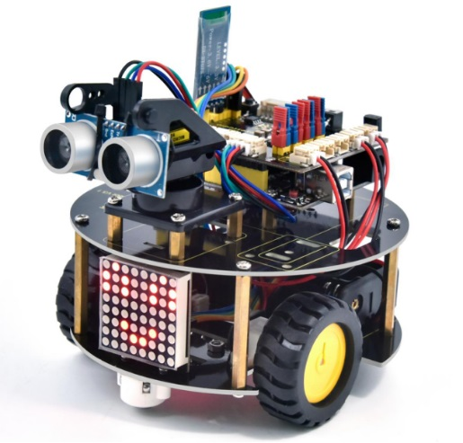

Nowadays, technological education such as VR, kids programming, and artificial intelligence, has become a mainstream in educational industry. Thereby, people attach more importance to STEAM education. Arduino is notably famous for Maker education.

So what is Arduino? Arduino is an open-source electronics platform based on easy-to-use hardware and software.Arduino boards are able to read inputs - light on a sensor or a Twitter message - and turn it into an output - activating a motor, turning on an LED,publishing something online. Based on this, Keyestudio team has updated a turtle robot V3.0.

It has a Keyestudio 4.0 board compatible with Arduino IDE and Scratch. The 4.0 board can read sensors and controls drivers by a driver expansion board.

This product boasts 16 learning projects, from simple to complex, which will guide you to make a smart turtle robot and introduce the detailed knowledge about sensors and modules.

---------------

## 1.3 Kit List

**When you receive this kit, check it according to the following list to ensure that all parts are intact. If you find any missing parts, please contact our sales staff immediately.**

| NO. |                     NAME                     | QTY  |                 PIC                |
| :--: | :---------------------------: | :------: | :----------------------------------: |
|  1   | Keyestudio V4.0 Board(UNO compatible) |    1     | 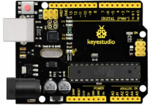 |
|  2   | Keyestudio 8833 Driver Expansion Board |     1    | 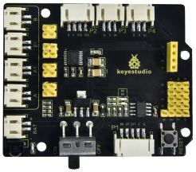 |
|  3   | Keyestudio Line Tracking Sensor|     1     | 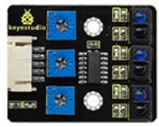 |
|  4   |Keyestudio Motor Connector A|     1     | 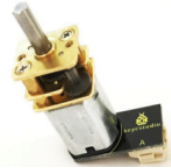 |
|  5   |Keyestudio Motor Connector B|     1     | 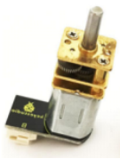 |
|  6   | Keyestudio 8*8 Dot Matrix Module|     1     | 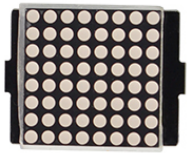 |
|  7   |Keyestudio Ultrasonic Module|     1    | 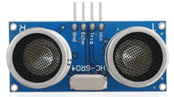 |
|  8   |DX-BT24 V5.1 BLE BT Module|     1    |  |
|  9  |Keyestudio Remote Control|     1    |  |
|  10  |15CM-5P 24AWG Wire|     1    | 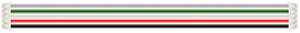 |
|  11  |15CM-4P to 2.54 Dupont Wire|     1    | 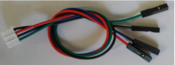 |
|  12  |160mm 2P 24AW Wire|    2    | 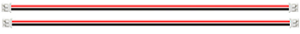 |
|  13  |Battery Holder |    1    | 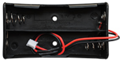 |
|  14  |4 AA Battery Holder|     1    | 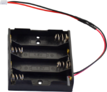 |
|  15  |M2*12MM Round Head Screws |    4    | 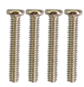|
|  16  |M2 Nuts |     4    |  |
|  17  |M3*6MM Round Head Screws|    27   | 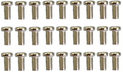 |
|  18  |M3*10MM Flat Head Screws|     2    | 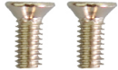 |
|  19  |M3 Nuts |     5    |  |
|  20  | M3*10MM Hexagon Copper Bush|     8    | 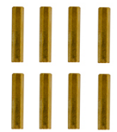 |
|  21  | M3*40MM Hexagon Copper Bush  |     4   | 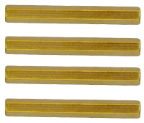 |
|  22  |Keyestudio 9G Servo |     1   | 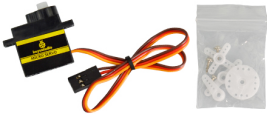 |
|  23  |N20 Motor Wheel |     2   | 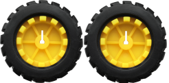 |
|  24  |N20 Motor U Type Mount|     2    | 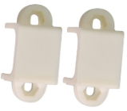 |
|  25  |Black Plastic Platform|    1   | 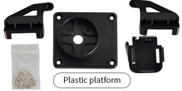 |
|  26  |Arduino 3PI Universal Caster|    2    | 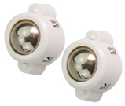 |
|  27  |3*40MM Black-yellow  Screwdriver|     1    | 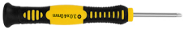 |
|  28  |1m Transparent Blue USB Cable |     1   | 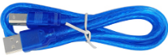 |
|  29  |3*100MM Black Ties|     5    | 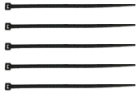 |
|  30  |Keyestudio Bottom Board |     1    | 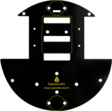 |
|  31  |Keyestudio Top Board|     1    | 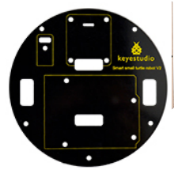 |
|  32  |F-F 20CM/40P Dupont Cable |    4    | 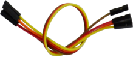  |
|  33  |20cm 3pin F-F Dupont Cable |    1   | 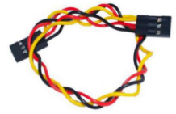 |
|  34  |Keyestudio Red LED Module|     1    | 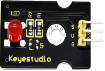 |
|  35  |Blue Jumper Caps|    4   | 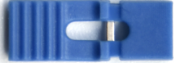 |
|  36  |Red Jumper Caps |    4   | 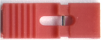 |
|  37  |Decorative Board|    1    | 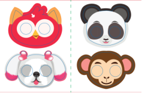 |
|  38  |Winding Pipe |     1    | 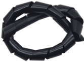 |
|  39  |Tracking Runway|     1    | 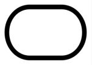 |

---------------

## 1.4 Parameters

- Working voltage: 5v
- Input voltage: 6-9V
- Maximum output current: 2A
- Maximum power dissipation: 25W (T=75℃)
- Motor speed: 5V 63 rpm
- Motor drive mode: DRV8833 motor driver
- Ultrasonic induction angle: <15 degrees
- Ultrasonic detection distance: 2cm-400cm
- Infrared remote control distance: <10M (measured)
- Bluetooth remote control distance: <20M(measured)
- Bluetooth control: support Android and iOS system

---------------

## 1.5 Features

1. Multi-purpose function: Obstacle avoidance, following, IR remote control, Bluetooth control, confined with a circle, ultrasonic following and facial emoticons display.
2. Simple assembly: No soldering circuit required, complete assembly easily.
3. High Tenacity: Aluminum alloy bracket, metal motors, high quality wheels and tracks
4. High extension: expand other sensors and modules through motor driver shield and sensor shield
5. Multiple controls: IR remote control, App control(iOS and Android system)
6. Basic programming：C language code of Arduino IDE and Kidsblock graphical programming.

---------------

## 1.6 Keyestudio V4.0 Development Board

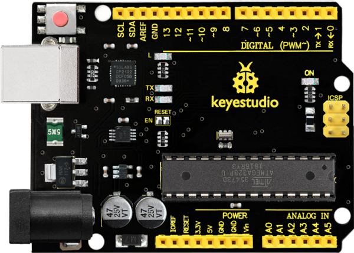

### 1.6.1 Description

Keyestudio V4.0 development board is an Arduino uno-compatible board, which is based on ATmega328P MCU, and with a cp2102 Chip as a UART-to-USB converter. 

Keyestudio V4.0 development board is an Arduino uno-compatible board, which is based on ATmega328P MCU, and with a cp2102 Chip as a UART-to-USB converter.  

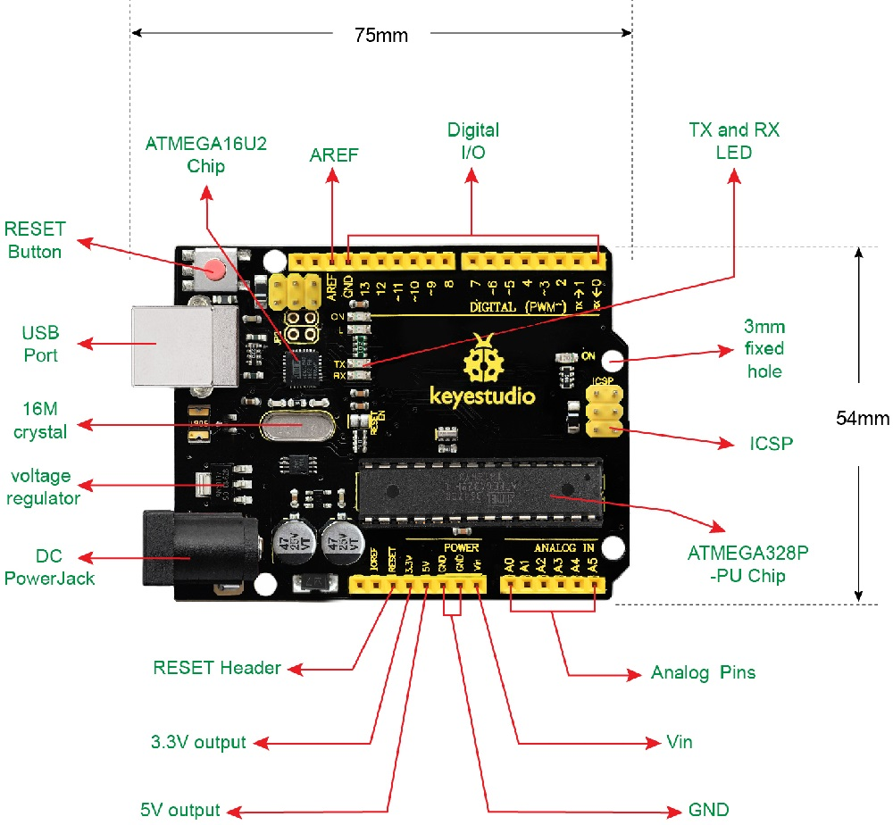

It has 14 digital input/output pins (of which 6 can be used as PWM outputs), 6 analog inputs, a 16 MHz quartz crystal, a USB connection, a power jack, 2 ICSP headers and a reset button.

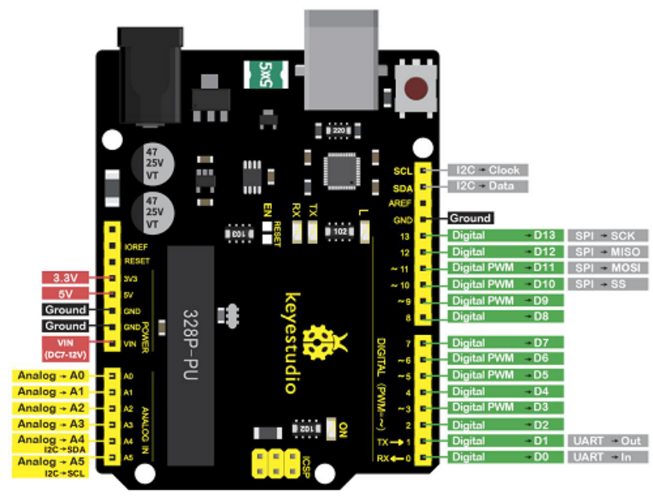

 It contains everything needed to support the microcontroller; simply connect it to a computer with a USB cable or power it via an external DC power jack (DC 7-12V) or via female headers Vin/ GND(DC 7-12V) to get started.

### 1.6.2 Parameters

- Microcontroller: ATmega328P-PU
- Operating Voltage: 5V
- Input Voltage (recommended): DC7-12V
- Digital I/O Pins: 14 (D0-D13) (of which 6 provide PWM output)
- PWM Digital I/O Pins: 6 (D3, D5, D6, D9, D10, D11)
- Analog Input Pins: 6 (A0-A5)
- DC Current per I/O Pin: 20 mA
- DC Current for 3.3V Pin: 50 mA
- Flash Memory: 32 KB (ATmega328P-PU) of which 0.5 KB used by bootloader
- SRAM: 2 KB (ATmega328P-PU)
- EEPROM: 1 KB (ATmega328P-PU)
- Clock Speed: 16 MHz
- LED_BUILTIN: D13

## 1.7 Keyestudio 8833 motor driver expansion board

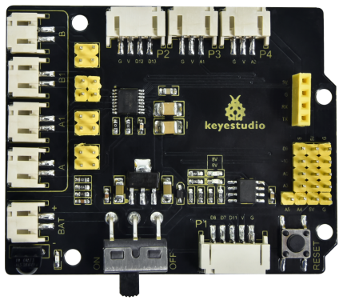

### 1.7.1 Description

The Keyestudio 8833 motor driver expansion board is compatible with the keyestudio development board. Just stack it onto the development board

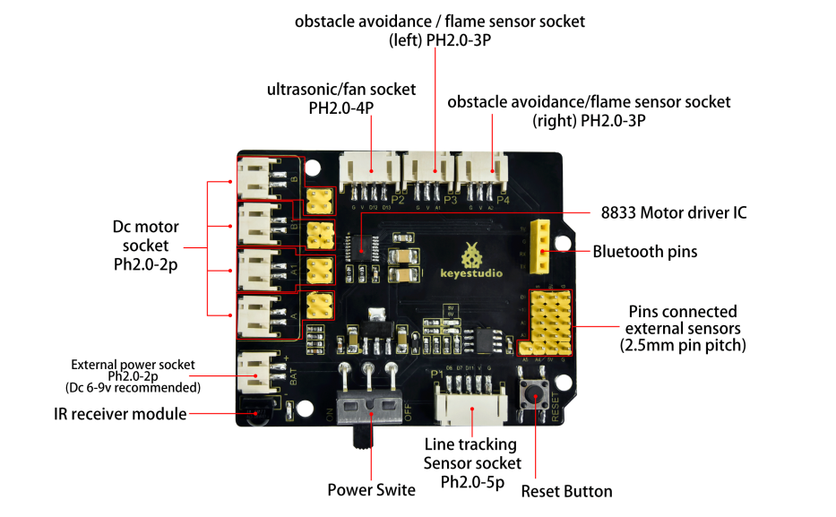

