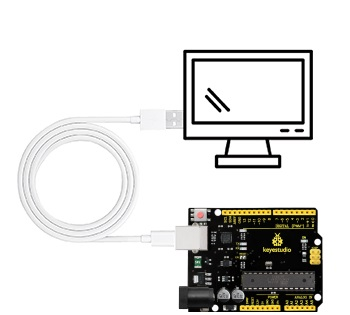
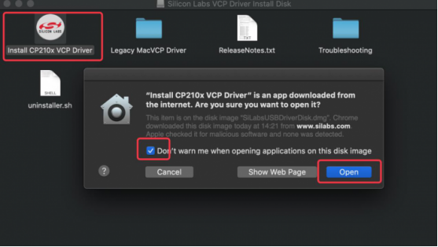
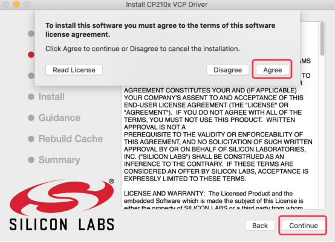
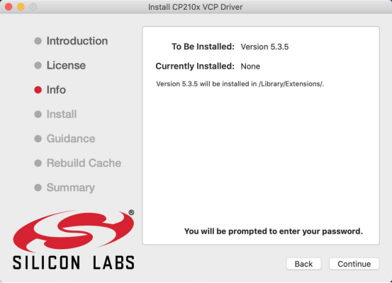
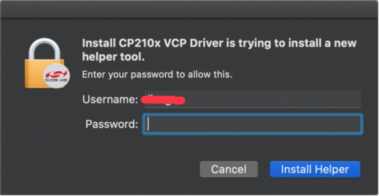
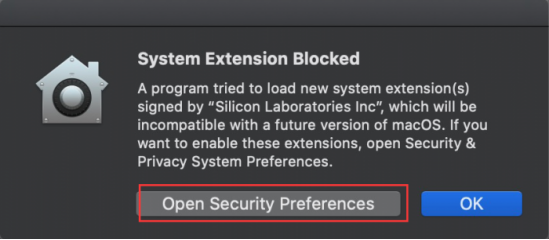
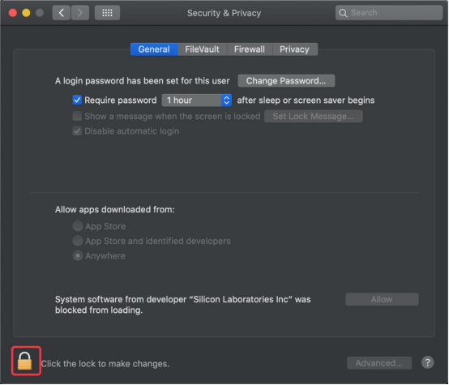
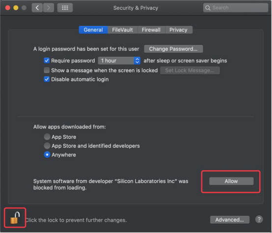
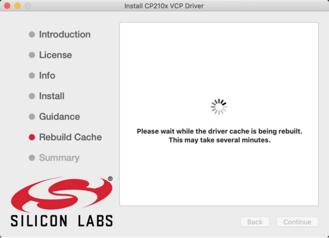
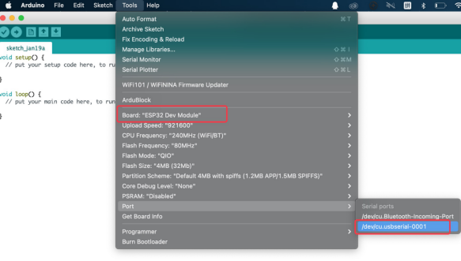

# 2. Driver Installation

This section is not mandatory to read. Sometimes the keyestudio V4.0 development board cannot be recognized by the computer. So you may need this part.

If the board is not recognized, please try another USB port or install the driver.

## 2.1 Windows System

### 2.1.1 Checking the driver

1、Connect the motherboard to the computer.

2、Open Device Manager，Open the device manager, if the prompt **"Silicon Labs CP210x USB to UART Bridge (COMx)"** appears to prove that the driver has been installed, please skip the **"Driver installation"** part.

### 2.1.2 Manual driver installation

1、Driver download

- Windowns System: [Windowns System driver](./Windows.7z)

2、Connect the motherboard to the computer, open the device manager, if there is a yellow exclamation mark in front of the driver in the picture, it proves that the driver is not installed, please download the driver and install it manually.

## 2.2 MAC System

## 2.2.1 Checking the driver

Connect the development board to the computer, according to [Tools] ---> [Port] to select the development board port (Note: If you can not confirm which port is the development board, please connect the motherboard to take pictures to record all the ports, and then unplug the development board to re-take pictures to record all the ports, and then compare to find the disappeared ports, and then unplug the motherboard after the disappeared ports is the port of the board, and then select the port on the line)If you can not recognize the port, please replace the computer USB port or around the phone cable to re-recognize the port, if it still does not work refer to the following steps to install the driver.

## 2.2.2 Manual driver installation

1、Driver download

Mac System: [Mac System driver](./Mac.7z)

2、double-click to decompress the downloaded driver zip package

3、Open folder and double-click“**SiLabsUSBDriverDisk.dmg**” file.

You will view the following files as follows:

4、Double-click“**Install CP210x VCP Driver**”, check“**Don’t warn me when opening application on this disk image**”and click“**Open**”.

5、Click“**Continue**”.

6、Click "**Agree**" and then click "**Continue**". 

7、Click “**Continue**” and enter your user password.

8、Select “**Open Security Preferences**”.

9、Click the lock to unlock security & privacy preference, enter your user password to authorize, and then click“**unlock**”.

10、See the lock has been opened, click“**Allow**”.

11、Back to installation page, and wait to install.

12、Successfully installed.

13、Open arduinoIDE，click“**Tools**”, select Board“**ESP32 Dev Module**” and port“**/dev/cu.usbserial-0001**”。

14、Clickto upload code and show “Done uploading”.

