## 4.2.1 Arduino IDE

Arduino IDE is an integrated development environment dedicated to Arduino which is an open-source electronics platform based on easy-to-read interface and simplified programming process, aimed at students without a background in electronics. 

Its clear interface, syntax highlighting and auto-completion functions make the programming process easy and enjoyable. It also offers a wealth of tutorials, sample codes, and community support to help beginners get started quickly and solve practical  problems.

Importantly, it is published as an open source tool. Therefore,  it not only accelerates users own learning process by utilizing and referring others’ works, it is also available for extension experienced programmers to freely access, modify and distribute codes.

In one word, Arduino IDE is easy-to-use for beginners, yet flexible enough for advanced users to take advantage of as well.

## 4.2.2  Windows

**Here we test on Arduino IDE v2.3.6. If you use other versions, it may fail to compile and upload codes.** 

### 4.2.2.1 Arduino IDE Download

Arduino official: [Software | Arduino](https://www.arduino.cc/en/software/)

Arduino boasts multiple versions such as Widows, mac and Linux(as shown below), please ensure that the one you download is compatible with your computer.

Here we download **Windows Win 10 or newer(64-bit)**. You can also choose the **Windows ZIP file**.


Here,  we will take Windows system as an example to introduce how to download and install it. Two versions are provided for Windows: for installing(Windows Win 10 or newer(64-bit)) and for downloading(Windows ZIP file, no need to install).

### 4.2.2.2 Arduino IDE Installation

1\. Save the .exe file downloaded from the software page to your hard drive and simply run the file.

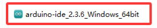

2\. Read the License Agreement and agree it.


3\. Choose the installation options.


4\. Choose the install location.


5\. Click finish and run Arduino IDE.


## 4.2.3 MacOS

### 4.2.3.1 Arduino IDE Download

Arduino official: [Software | Arduino](https://www.arduino.cc/en/software/)

Here we download **macOS Intel 10.15 Catalina or newer(64-bit)**. You can also choose **macOS Apple Silicon 11 Big Sur or newer(64-bit)**.


### 4.2.3.2 Arduino IDE Installation

After download, open `arduino_ide_xxxx.dmg` and move the **Arduino IDE.app** into **Applications**.


## 4.2.4 Linux

### 4.2.4.1 Arduino IDE Download

Arduino official: [Software | Arduino](https://www.arduino.cc/en/software/)

Here we download **Linux Applmage(64-bit X86-64)**. You can also choose **Linux ZIP file(64-bit X86-64)**.


### 4.2.4.2 Arduino IDE Installation

For how to install Arduino IDE on Linux: [https://docs.arduino.cc/software/ide-v2/tutorials/getting-started/ide-v2-downloading-and-installing/#linux](https://docs.arduino.cc/software/ide-v2/tutorials/getting-started/ide-v2-downloading-and-installing/#linux)

## 4.2.5 Arduino IDE Languages

⚠️ **The setting method is the same on Windows, MAC, etc.**

1\. Open Arduino IDE.

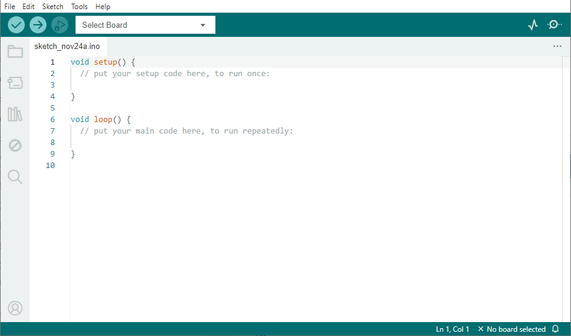

2\. In “**File** ——>**Preferences...**”, choose “**English**” and “**OK**”.

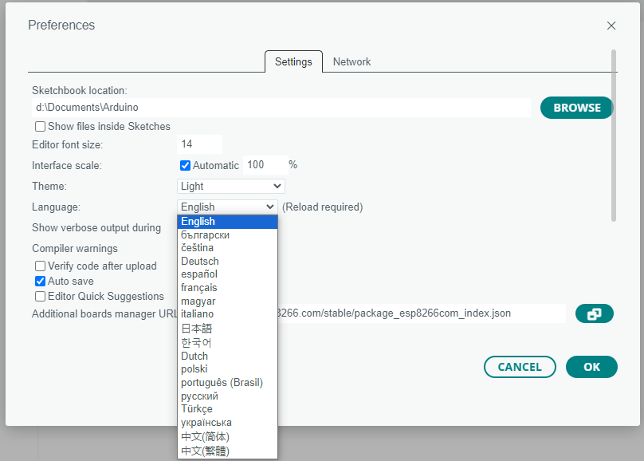

## 4.2.6 Arduino IDE Main Interface

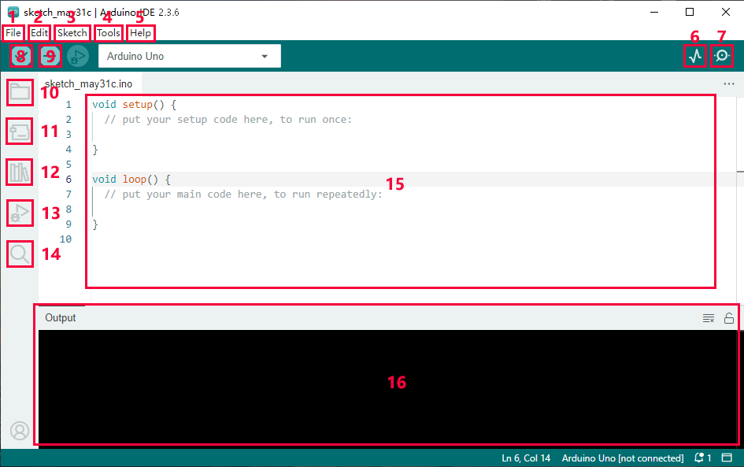

1. **File** - includes new Sketch, open Sketch, open recently used code, open sample code, close the IDE, save code, preferences, advanced Settings, etc.
2. **Edit** - includes copy, paste, automatic formatting, font size, etc. (shortcut keys are recommended).
3. **Sketch** - includes verify\compile, upload code, import library and so on.
4. **Tools** - The most important two are development board and port.
5. **Help** - Views the IDE version and official reference documents.
6. **Open Serial Plotter** - displays serial data in a method of line graph
7. **Open Serial Monitor** - opens the Serial Monitor tool, as a new tab in the console.
8. **Verify** - compiles your code to your Arduino Board.
9. **Verify / Upload** - compiles and uploads your code to your Arduino Board.
10. **Sketchbook** - here you will find all of your sketches locally stored on your computer. Additionally, you can sync with the Arduino Cloud, and also obtain your sketches from the online environment.
11. **Boards Manager** - install or remove Arduino Boards .
12. **Library Manager** - browse through thousands of Arduino libraries or import local libraries
13. **Debugger** - test and debug programs in real time.
14. **Search** - search for keywords in your code.
15. **Code editing area**
16. **IDE prompt area** (Uploading fails or succeeds) & **Serial monitor display area**

## 4.2.7 Import Library

### 4.2.7.1 What are Libraries?

A library is a collection of codes, and it facilitates the connection of sensors, displays and modules. 

For instance, the LiquidCrystal_I2C library simplifies the communication with LCD1602 display. Moreover, hundreds of libraries are available on Internet. In the reference, in-built and manually-added libraries are listed.

When you see “No such file or directory”, oops, libraries are missing! For instance, we do not include LiquidCrystal_I2C before uploading related codes:


### 4.2.7.2 How to Install the Libraries?

⚠️ <span style="color: rgb(255, 76, 65);">**Note: For how to install libraries, MAC and WINDOWS are the same.**</span>

1\. Click **Skerch>Include Library>Add .Zip Library...**

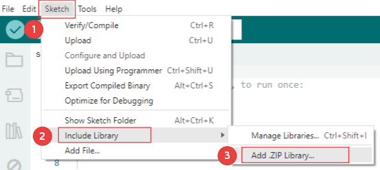

2\. Select the zipped files (We still take **Matrix** as an example.) you need and click **Open** to add a library. If success, the message bar will show “**Library installed**”.

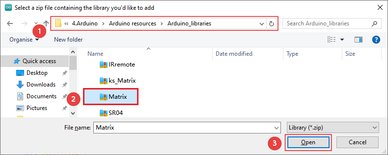

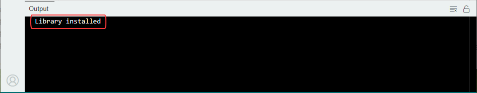

3\. The remaining library files can be added in a similar way. You can refer to the above method for details. Therefore, I won't explain it again here.

## 4.2.8 Upload Code on Arduino IDE

Connect the board to your computer via the USB cable.


Connect the the corresponding Arduino Uno board model in Arduino IDE.

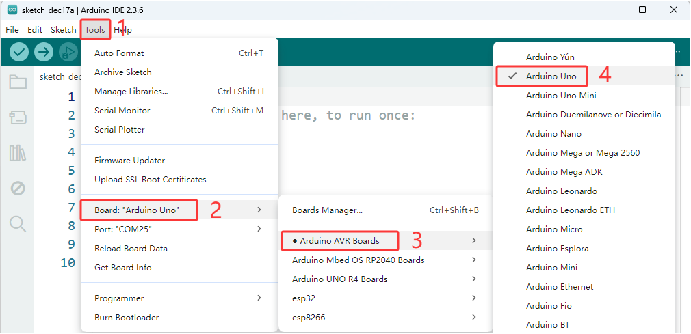

Choose COM port. You may check your port number at Device Manager. If there are many COM ports, unplug the cable of board to see which port disappears. Then that one is the port ready to use. If there is no COM port, please check whether driver is installed.

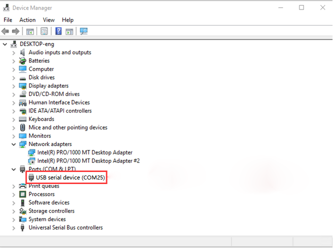

Herein, our COM port is COM25. Click “Tools” → “Port” → “COM25”.

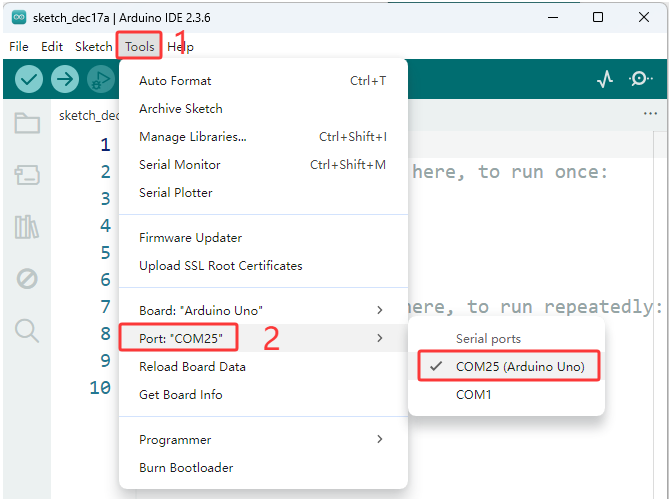

When the board is connected, both of these places appear its model. Here we provide a sample code that prints “Hello Keyes!” once per second in the serial monitor.

Copy and paste the following code to Arduino IDE.

```c
/*
  keyes 
  Print “Hello Keyes!”
  http://www.keyesrobot.com
*/
void setup() {  
    // put your setup code here, to run once:
    Serial.begin(9600);  //Set the serial port baud rate to 9600
}

void loop() {  
    // put your main code here, to run repeatedly:
    Serial.println("Hello Keyestudio!");  //Serial port printing
 	delay(1000);  //Delay of 1 second
}
```

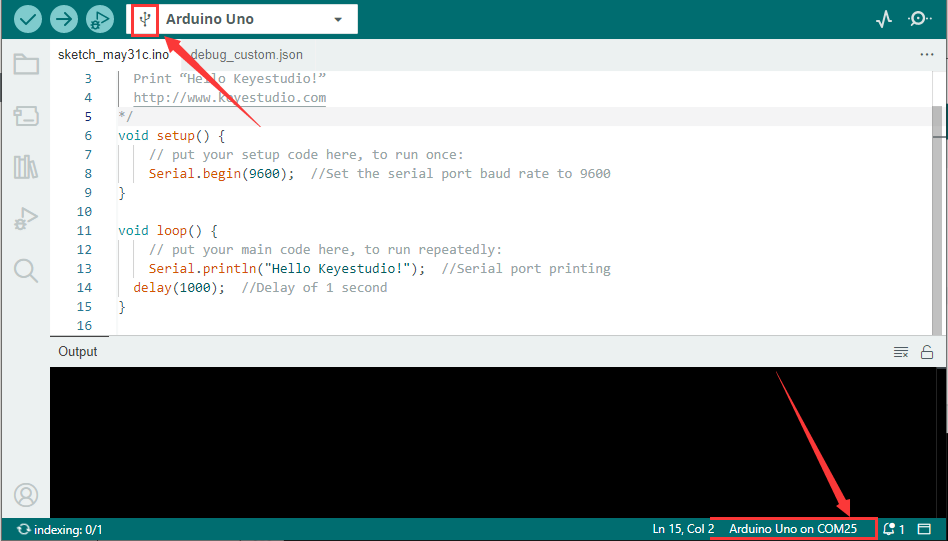

Click  to compile and upload code. Two prompts will appear after upload is successful:

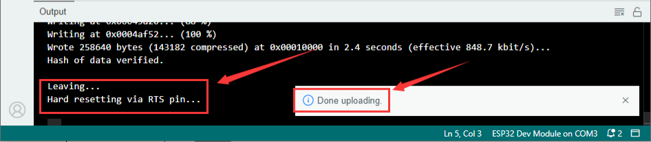

Click  to show serial monitor and set baud rate to 9600. You will see “**Hello Keyestudio!**” on the monitor.

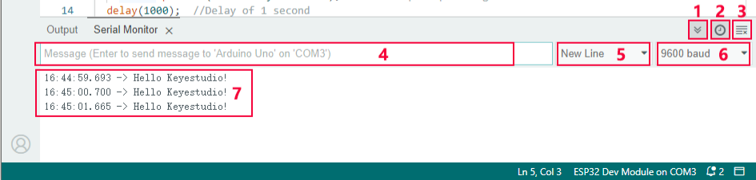

1. **Toggle Auto-scroll** - Sets whether the prints scroll automatically
2. **Toggle Timestamp** - Sets whether to display print time
3. **Clear Output** - Clears printed messages
4. **Serial Input**
5. **Serial Output Format**
6. **Baud Rate** - Sets the baud rate you need
7. **Printing Window**

## 4.2.9 Arduino C Basic Codes

To learn more about the Arduino codes, check out the [Language Reference | Arduino Documentation](https://docs.arduino.cc/language-reference/).

---------------