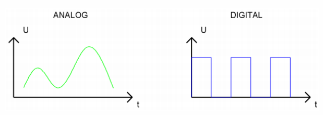

### 4.3.2 Adjust LED Brightness

#### 4.3.2.1 Introduction

Here we introduce you how to adjust the brightness of LED via Pulse Width Modulation(PWM). It changes the brightness by quickly switching the power supply. In detail, PWM controls the average current of the LED by adjusting the duty cycle of signals, thus achieving stepless adjustment of brightness.

This project cover s PWM principle, circuit design, programming and practical operation, aiming at controlling LED brightness and applying it to many other experiments.

#### 4.3.2.2 Knowledge

**Analog / Digital signal** 

An Analog Signal is a continuous signal in both time and value. On the contrary, a Digital Signal is a time series consisting of a sequence of quantities. Most signals in life are analog signals. A familiar example of an Analog Signal would be how the temperature throughout the day is continuously changing and could not suddenly change instantaneously from 0℃ to 10℃. However, Digital Signals can instantaneously change in value. This change is expressed in numbers as 1 and 0 (binary). Their differences can more easily be seen when compared when graphed as below. 



**PWM**

PWM, Pulse Width Modulation, is a very effective method for using digital signals to control analog circuits. Common processors cannot directly output analog signals. PWM technology makes it very convenient to achieve this conversion (translation from digital to analog signals). 

PWM technology uses digital pins to send certain frequencies of square waves, that is, the output of high levels and low levels, which alternately last for a certain period. The total time is generally fixed, which is called the **period** (the reciprocal of the period is frequency). The time of high level outputs are generally called “pulse width”, and the duty cycle is the percentage of the ratio of pulse duration, or pulse width (PW) to the total period (T) of the waveform. The longer the high levels last, the longer the duty cycle and the higher the corresponding voltage in the analog signal will be. 

The following figures show how the analog signal voltages vary between 0V-5V (high level is 5V) corresponding to the pulse width 0%-100%.


The longer the PWM duty cycle is, the higher the output power will be. So we can use PWM to control the brightness of an LED or the speed of DC motor. PWM is not real analog, but the effective value of the voltage is equivalent to the corresponding analog. Therefore, we can control the output power of output modules.

For the Arduino digital port voltage output, there are only LOW and HIGH, which correspond to the voltage output of 0V and 5V. You can define LOW as 0 and HIGH as 1, and let the Arduino output five hundred 0 or 1 signals within 1 second.
If output five hundred 1, that is 5V; if all of which is 1, that is 0V. If output 010101010101 in this way then the output port is 2.5V, which is like showing movie. The movie we watch are not completely continuous. It actually outputs 25 pictures per second. In this case, the human can’t tell it, neither does PWM. If want different voltage, need to control the ratio of 0 and 1. The more 0,1 signals output per unit time, the more accurately control.

#### 4.3.2.3 Components

| Keyestudio 4.0 development board *1 | Keyestudio 8833 motor driver expansion board *1 | Red LED Module*1 |
| :--: | :--: | :--: |
| | |  |
|3P F-F Dupont Wire*1|USB cable*1| |
||| |

#### 4.3.2.4 Wiring Diagrame

G, V and S of the LED module are connected to G, 5V and D9

⚠️ **Attention: You do not need to disassemble the Smart Little Turtle Robot and re-connect the module. Here this disgram will be convenient for you to program and write code.**


#### 4.3.2.5 Test Code

```c++
/*
 keyestudio smart turtle robot
 lesson 2.1
 pwm
 http://www.keyestudio.com
*/
int ledPin = 9; // Define the LED pin at D9
int value;

void setup () {
  pinMode (ledPin, OUTPUT); // initialize ledpin as an output.
}

void loop () {
  for (value = 0; value <255; value = value + 1) 
  {
    analogWrite (ledPin, value); // LED lights gradually light up
    delay (5); // delay 5ms
  }
  for (value = 255; value> 0; value = value-1) 
  {
    analogWrite (ledPin, value); // LED gradually goes out
    delay (5); // delay 5ms
  }
}
```

#### 4.3.2.6 Test Result

Upload test code successfully, LED gradually changes from bright to dark, like human’s breath, rather than turning on and off immediately.

#### 4.3.2.7 Code Explanation

```c
for (int i = 0; i < 255; i++) {
    ...
}
```

- `for` → Create a count loop. Official definition: [for | Arduino Documentation](https://docs.arduino.cc/language-reference/en/structure/control-structure/for/)
- `int i = 0` → Count from 0
- `i < 255` → Loop condition (executed when i<255). Official definition: [<(less than) | Arduino Documentation](https://docs.arduino.cc/language-reference/en/structure/comparison-operators/lessThan/)
- `i++` → Each cycle i increases by 1.Official definition: [++ (increment) | Arduino Documentation](https://docs.arduino.cc/language-reference/en/structure/compound-operators/increment/)


①: Set the initial value of the loop; execute only once; then enter ②

②: Determine whether to meet the condition. Herein, `i <= 255`, i is less than or equal to 255 to enter the loop code ③

③: Loop code, put the code that needs to loop here. For instance, if we need to control pwm value from 0 to 255, we set i to pwm and enter ④

④： i++ adds 1 to the value of original i, which also means i = i +1. So does i- -(i = i - 1). After that, run code ⑤

⑤： After i + 1 (or i - 1), determine whether i is less than or equal to 255. If yes, execute code ③. If not, exit the for loop.

---------------------

```c
analogWrite(ledPin, i);   //Output PWM
```

- `analogWrite()` → Arduino PWM output function
- `ledPin` →  Pins supporting PWM (with “~”)
- `i` → Duty cycle (0-255)

Official definition: [analogWrite() | Arduino Documentation](https://docs.arduino.cc/language-reference/en/functions/analog-io/analogWrite/)


#### 4.3.2.8 Extension Practice

Let’s modify the value of delay and remain the pin unchanged, then observe how LED changes.

```c
/*
 keyestudio smart turtle robot
 lesson 2.2
 pwm
 http://www.keyestudio.com
*/
int ledPin = 9; // Define the LED pin at D9
void setup () {
   pinMode(ledPin, OUTPUT); // initialize ledpin as an output.
}

void loop () {
   for (int value = 0; value <255; value = value + 1) {
     analogWrite (ledPin, value); // LED lights gradually light up
     delay (30); // delay 30MS
   }
   for (int value = 255; value> 0; value = value-1) {
     analogWrite (ledPin, value); // LED gradually goes out
     delay (30); // delay 30MS
   }
}
```

Upload the code to development board, then LED blinks more slowly.
