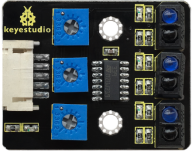
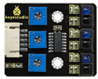
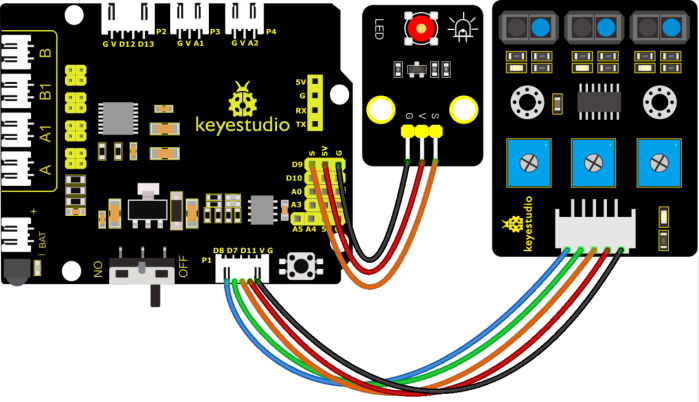

### 4.3.3 Line Tracking Sensor 

#### 4.3.3.1 Introduction

The tracking sensor is actually an infrared sensor. The component used here is the TCRT5000 infrared tube. 
Its working principle is to use different reflectivity of infrared light to colors, then convert the strength of the reflected signal into a current signal. 
During the process of detection, black is active at HIGH level while white is active at LOW level. The detection height is 0-3 cm. 
Keyestudio 3-channel line tracking module has integrated 3 sets of TCRT5000 infrared tube on a single board, which is more convenient for wiring and control. 
By rotating the adjustable potentiometer on the sensor, it can adjust the detection sensitivity of the sensor.

#### 4.3.3.2 Component Knowledge



**Parameters:**

- Operating Voltage: 3.3-5V (DC)
- Interface: 5PIN
- Output Signal: Digital signal
- Detection Height: 0-3 cm


#### 4.3.3.3 Components

| Keyestudio 4.0 development board *1 | Keyestudio 8833 motor driver expansion board *1 | Red LED Module*1 |
| :--: | :--: | :--: |
| | |  |
|3P F-F Dupont Wire*1|USB cable*1|5P Dupont wire*1 |
||||
|Keyestudio line tracking sensor*1| | |
|| | |

#### 4.3.3.4 Wiring Diagram

G, V, S1, S2 and S3 of the line tracking sensor are connected to G（GND), V（VCC), D11, D7 and D8 of the sensor expansion board.

⚠️ **Attention: You do not need to disassemble the Smart Little Turtle Robot and re-connect the module. Here this disgram will be convenient for you to program and write code.**


#### 4.3.3.5 Test Code


```c++
/*
keyestudio smart turtle robot
lesson 3.1 
 Line Track sensor
 http://www.keyestudio.com
*/
int L_pin = 11;  //pins of  left line tracking sensor
int M_pin = 7;  //pins of  middle line tracking sensor
int R_pin = 8;  //pins of  right  line tracking sensor
int val_L,val_R,val_M;// define the variable value of three sensors

void setup()
{
  Serial.begin(9600); // initialize serial communication at 9600 bits per second
  pinMode(L_pin,INPUT); // make the L_pin as an input
  pinMode(M_pin,INPUT); // make the M_pin as an input
  pinMode(R_pin,INPUT); // make the R_pin as an input
}

void loop() 
{ 
  val_L = digitalRead(L_pin);//read the L_pin:
  val_R = digitalRead(R_pin);//read the R_pin:
  val_M = digitalRead(M_pin);//read the M_pin:
  Serial.print("left:");
  Serial.print(val_L);
  Serial.print(" middle:");
  Serial.print(val_M);
  Serial.print(" right:");
  Serial.println(val_R);
  delay(500);// delay in between reads for stability
}
```

#### 4.3.3.6 Test Result

Upload the code, wire up the 4.0 board with a USB cable and open the serial monitor. You can view status of three line tracking sensors. When not signals are received, the value is 1. If we cover the sensor with a white paper, the value will be 0


#### 4.3.3.7 Code Explanation

**Serial.begin(9600)** -- Initialize serial port, set baud rate to 9600

**pinMode** -- Define the pin as input or output mode

**digitalRead** -- Read the state of pin, which are generally HIGH and LOW level

#### 4.3.3.8 Extension Practice

After knowing its working principle, you can connect an LED to D9 so as to control LED by it.

⚠️ **Attention: You do not need to disassemble the Smart Little Turtle Robot and re-connect the module. Here this disgram will be convenient for you to program and write code.**



```c
/*
keyestudio smart turtle robot
lesson 3.2
 Line Track sensor
 http://www.keyestudio.com
*/
int L_pin = 11;  //pins of  left line tracking sensor
int M_pin = 7;  //pins of  middle line tracking sensor
int R_pin = 8;  //pins of  right line tracking sensor
int val_L,val_R,val_M;// define the variables of three sensors 

void setup()
{
  Serial.begin(9600); // initialize serial communication at 9600 bits per second
  pinMode(L_pin,INPUT); // make the L_pin as an input
  pinMode(M_pin,INPUT); // make the M_pin as an input
  pinMode(R_pin,INPUT); // make the R_pin as an input
  pinMode(9, OUTPUT);
}

void loop() 
{ 
  val_L = digitalRead(L_pin);//read the L_pin:
  val_R = digitalRead(R_pin);//read the R_pin:
  val_M = digitalRead(M_pin);//read the M_pin:
  Serial.print("left:");
  Serial.print(val_L);
  Serial.print(" middle:");
  Serial.print(val_M);
  Serial.print(" right:");
  Serial.println(val_R);
  delay(500);// delay in between reads for stability
  if ((val_L == LOW) || (val_M == LOW) || (val_R == LOW))//if left line tracking sensor detects signals
  { 
    Serial.println("HIGH");
    digitalWrite(9, HIGH);//LED is off
  }
  else//if left line tracking sensor doesn’t detect signals
  { 
    Serial.println("LOW");
    digitalWrite(9, LOW);//LED is off
  }
 }
```

Upload the code to development board and power it up with a USB cable.

Make a paper close to the sensor.

Then we can find LED light up when covering the line tracking sensor 