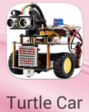
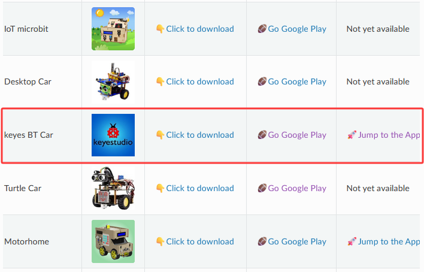
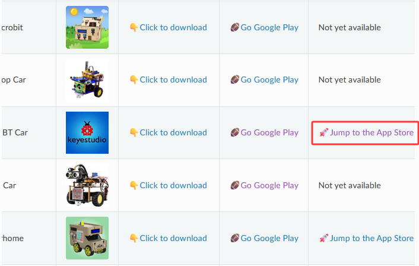
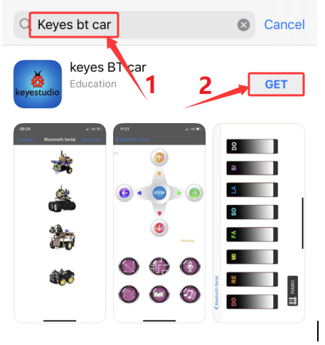
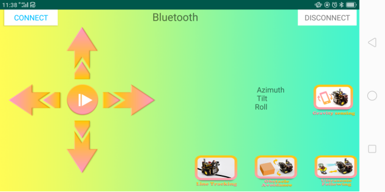
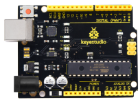
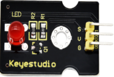
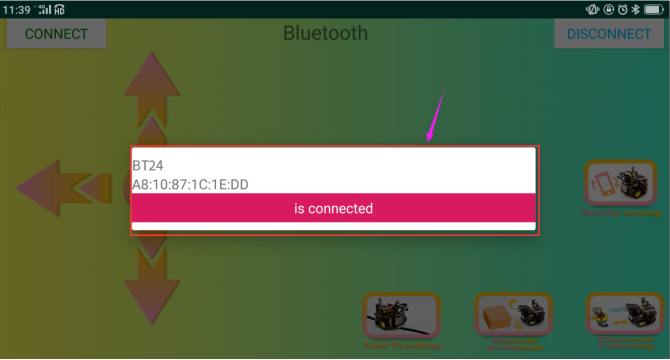

### 4.3.7 Bluetooth Remote Control

#### 4.3.7.1 Introduction


There is a DX-BT24 5.1 Bluetooth module in this kit. This bluetooth module comes with 256Kb space and complies with V5.1BLE bluetooth specification, which supports AT commands. Users can change parameters such as the baud rate and device name of the serial port as required. 

Furthermore, it supports UART interface and bluetooth serial port transparent transmission, which also contains the advantages of low cost, small size, low power consumption and high sensitivity for sending and receiving. Notably, it solely needs a few peripheral components to realize its powerful functions.  

#### 4.3.7.2 Component Knowledge

**Parameters**

- Bluetooth protocol: Bluetooth 
- Specification V5.1 BLE 
- Working distance: In an open environment, achieve 40m ultra-long distance - communication Operating frequency: 2.4GHz ISM band 
- Communication interface: UART 
- Bluetooth certification: in line with FCC CE ROHS REACH certification standards 
- Serial port parameters: 9600, 8 data bits, 1 stop bit, invalid bit, no flow control 
- Power: 5V DC 
- Operating temperature: –10 to +65 degrees Celsius

**Application**

The DX-BT24 module also supports the BT5.1 BLE protocol, which can be directly connected to iOS devices with BLE Bluetooth function, and supports resident running of background programs. Mainly used in the field of short-distance data wireless transmission. Avoid cumbersome cable connections and can directly replace serial cables. Successful application areas of BT24 modules:

※ Bluetooth wireless data transmission; 
※ Mobile phone, computer peripheral equipment; 
※ Handheld POS equipment; 
※ Wireless data transmission of medical equipment; 
※ Smart home control;
※ Bluetooth printer; 
※ Bluetooth remote control toys; 
※ Shared bicycles;

**Ports**


① STATE：Status pin
② RX：Receiving pin
③ TX：sending pin
④ GND：GND
⑤ VCC：Power
⑥ EN：Enable pin

<span style="color: rgb(255, 76, 65);">Connect the BT module to the development board.</span>

| Keyestudio 8833 motor driver expansion board| BT24 Bluetooth|
| :--: | :--: | 
| TX | RX |
|RX|TX|
|VCC|5V|
|GND|GND|

#### 4.3.7.3 Download and install APP

1. Visit www.keyestudio.com


2. Find “**WiKi**”，and then click "**Docs Tutorials**".


3. Click “**Download_Center**” to find the APP.


**4. Android**

Find “**Turtle Car**” (<span style="color: rgb(255, 76, 65);">**allow APP to access“location”, you could enable “location”in settings of your cellphone**</span>).


Download **Turtle Car.apk**.


Next, follow the instructions to install the app. The app icon is shown below after installation.



Click app to enter the following page.


**5. IOS**

Find “**keyes BT Car**” (<span style="color: rgb(255, 76, 65);">**allow APP to access“location”, you could enable “location”in settings of your cellphone**</span>).



Click **Jump to the App Store** to navigate to the App Store.



Search for "**keyes BT car**" directly in the App Store.



After installation, enter its interface.


Click “**Connect**” to search and pair Bluetooth. 


Click  to enter the main page of turtle smart car.




#### 4.3.7.4 Components

| Keyestudio 4.0 development board *1 | Keyestudio 8833 motor driver expansion board *1 | Red LED Module*1 |
| :--: | :--: | :--: |
| | |  |
|3P F-F Dupont Wire*1|USB cable*1|DX-BT24 BT Module*1 |
||||


#### 4.3.7.5 Test Code

```c++
/*
keyestudio smart turtle robot
lesson 7.1
bluetooth 
http://www.keyestudio.com
*/
char ble_val; //character variable, used to store the value received by Bluetooth 


void setup() {
  Serial.begin(9600);
}
void loop() {
  if(Serial.available() > 0)  //make sure if there is data in serial buffer
  {
    ble_val = Serial.read();  //Read data from serial buffer
    Serial.println(ble_val);  //Print
  }
}
```

#### 4.3.7.6 Wiring Diagram

RXD, TXD, GND and VCC of the BT module are connected to TX, RX, G（GND) and 5V（VCC).

STATE and BRK of the BT module don’t need connection.


<span style="color: rgb(255, 76, 65);">Note the direction of the BT module when inserting it onto the 8833 board. And don’t insert it before uploading the code.</span>
<br>
<br>
<span style="color: rgb(255, 76, 65);">Don’t connect the BT module when uploading the code because serial communication port will be occupied when uploading code and inserting the BT module.</span>

#### 4.3.7.7 Test Result

⚠️  <span style="color: rgb(255, 76, 65);">**Note: Remove the BT module when you are uploading the code, otherwise you will fail to upload it.  When the code uploading process is done, open the GPS on your phone, and then reconnect the Bluetooth module.**</span>

Upload the code and power up the 4.0 board with a USB cable. Insert the BT module and then go to open BT app.


After connecting Bluetooth, plug in power and LED indicator of Bluetooth module will flicker. Tap  to search Bluetooth.


Click “**connect**” below HMSoft, then the Bluetooth will be connected and its LED indicator will stay on.



After connecting Bluetooth module, open serial monitor to set baud rate to 9600. Pressing the button of the Bluetooth APP, and the corresponding characters are displayed as shown below:


We have read the characters of each key on mobile APP via serial port and know the function of those keys. 

#### 4.3.7.8 Code Explanation

**Serial.available()**: return the number of characters currently remaining in the serial port buffer. Generally, this function is used to judge whether there is data in the buffer of the serial port. When Serial.available()>0, it means that the serial port has received data and can be read; 


**Serial.read()**: refers to taking out and reading a Byte of data from the serial port buffer. For example, if a device sends data to Arduino through the serial port, we can use Serial.read() to read the sent data.

#### 4.3.7.9 Project Expansion：
Here we use the command sent by the mobile phone to turn on or off an LED light. Looking at the wiring diagram, an LED is connected to the D9 pin.


```c
/*
 keyestudio smart turtle robot
 lesson 7.2
 Bluetooth LED
 http://www.keyestudio.com
*/ 
int ledpin=9;
char ble_val;// An integer variable used to store the value received by Bluetooth

void setup()
{
  Serial.begin(9600);
  pinMode(ledpin,OUTPUT);
}

void loop()
{ 
  if (Serial.available() > 0) //Check whether there is data in the serial port cache
  {
    ble_val = Serial.read();  //Read data from the serial port cache
    Serial.print("DATA RECEIVED:");
    Serial.println(ble_val);
    if (ble_val == 'F') {
      digitalWrite(ledpin, HIGH);
      Serial.println("led on");
    }
    if (ble_val == 'B') {
      digitalWrite(ledpin, LOW);
      Serial.println("led off");
    }
   }
}
```

⚠️  <span style="color: rgb(255, 76, 65);">**Note: Remove the BT module when you are uploading the code, otherwise you will fail to upload it.  When the code uploading process is done, open the GPS on your phone, and then reconnect the Bluetooth module.**</span>

Upload the code, connect to the 4.0 development board with a USB cable, power up and click  and   to control the LED.