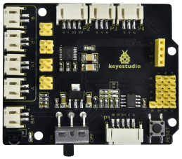
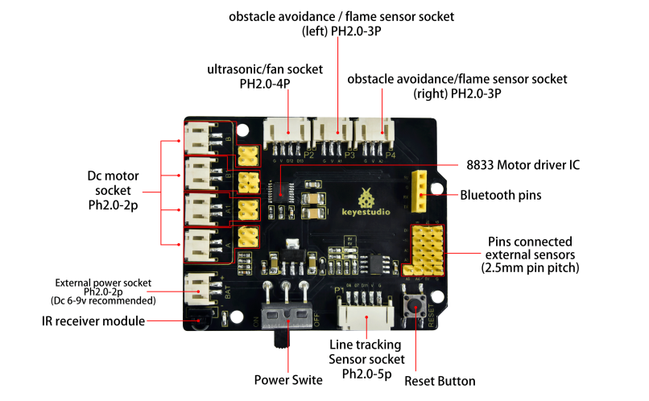
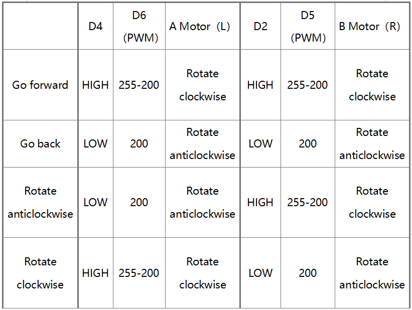
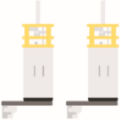
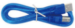
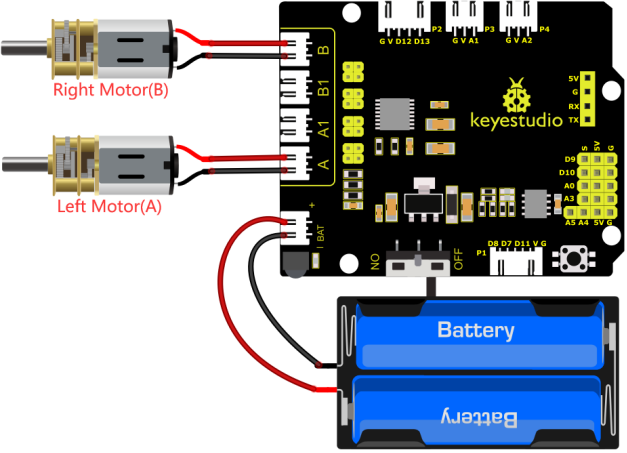

### 4.3.8 Motor Driving and Speed Control

#### 4.3.8.1 Introduction

The 8833 motor driver expansion board uses PH2.0 terminals and an 8833 motor driver chip driven by the two-channel H bridge whose the largest current can be up to be 1.5A. It also integrates an IR receiver, ultrasonic sensor ports, analog ports, line tracking interfaces and pin headers for BT wifi and servo drivers

#### 4.3.8.2 Component Knowledge



Keyestudio 8833 motor driver expansion board



**Parameter:**

- Logic part input voltage: DC 5V 
- Input voltage of driving part: DC 6-9 V 
- Logic part operating current: <36mA 
- Operating current of driving part: <2A 
- Maximum power dissipation: 25W (T=75℃) 
- Control signal input level: high level 2.3V<Vin<5V, low level -0.3V<Vin<1.5V 
- Working temperature: -25＋130℃

#### 4.3.8.3 Drive Robot to Move

From the above diagram, it is known that the direction pin of B motor is D2; a speed pin is D5; D4 is the direction pin of A motor; and D6 is speed pin.
PWM drives the robot car. The PWM value is in the range of 0-255. The larger the number, the faster the rotation of the motor.



#### 4.3.8.4 Components 

| Keyestudio 4.0 development board *1 | Keyestudio 8833 motor driver expansion board *1 | Motor*1 |
| :--: | :--: | :--: |
| | ||
|18650 Battery Holder*1|2P Dupont Wire*2|USB cable*1 |
||||

#### 4.3.8.5 Wiring Diagram



#### 4.3.8.6 Test Code

```c++
/*
 keyestudio smart turtle robot
 lesson 8.1
 motor driver shield
 http://www.keyestudio.com
*/ 
#define ML_Ctrl 4     //define the direction control pin of A motor
#define ML_PWM 6   //define the PWM control pin of A motor
#define MR_Ctrl 2    //define the direction control pin of B motor
#define MR_PWM 5   //define the PWM control pin of B motor

void setup()
{
  pinMode(ML_Ctrl, OUTPUT);//set direction control pin of A motor to output
  pinMode(ML_PWM, OUTPUT);//set PWM control pin of A motor to output
  pinMode(MR_Ctrl, OUTPUT);//set direction control pin of B motor to output
  pinMode(MR_PWM, OUTPUT);//set PWM control pin of B motor to output
}
void loop()
{ 
  //front
  digitalWrite(ML_Ctrl,HIGH);//set the direction control pin of A motor to HIGH
  analogWrite(ML_PWM,55);//set the PWM control speed of A motor to 55
  digitalWrite(MR_Ctrl,HIGH);//set the direction control pin of B motor to HIGH
  analogWrite(MR_PWM,55);// set the PWM control speed of B motor to 55
  delay(2000);//delay in 2000ms
  //back
  digitalWrite(ML_Ctrl,LOW);//set the direction control pin of A motor to LOW level
  analogWrite(ML_PWM,200);// set the PWM control speed of A motor to 200 
  digitalWrite(MR_Ctrl,LOW);//set the direction control pin of B motor to LOW level
  analogWrite(MR_PWM,200);//set the PWM control speed of B motor to 200
  delay(2000);//delay in 2000ms
  //left
  digitalWrite(ML_Ctrl,LOW);//set the direction control pin of A motor to LOW level
  analogWrite(ML_PWM,200);//set the PWM control speed of A motor to 200 
  digitalWrite(MR_Ctrl,HIGH);//set the direction control pin of B motor to HIGH level
  analogWrite(MR_PWM,55);//set the PWM control speed of B motor to 200
  delay(2000);//delay in 2000ms
  //right
  digitalWrite(ML_Ctrl,HIGH);//set the direction control pin of A motor to HIGH level
  analogWrite(ML_PWM,55);//set the PWM control speed of A motor to 55 
  digitalWrite(MR_Ctrl,LOW);// set the direction control pin of B motor to LOW level
  analogWrite(MR_PWM,200);//set the PWM control speed of B motor to 200
  delay(2000);//delay in 2000ms
  //stop
  digitalWrite(ML_Ctrl, LOW);// set the direction control pin of A motor to LOW level
  analogWrite(ML_PWM,0);//set the PWM control speed of A motor to 0
  digitalWrite(MR_Ctrl, LOW);// set the direction control pin of B motor to LOW level
  analogWrite(MR_PWM,0);//set the PWM control speed of B motor to 0
  delay(2000);// delay in 2000ms
}
```

#### 4.3.8.7 Test Result

Upload code, power on the external power and turn the DIP switch to O. The turtle car will go for ward for 2s, back for 2s, turn left for 2s and right for 2s and stop for 2s

#### 4.3.8.8 Code Explanation

**digitalWrite(ML_Ctrl,LOW)**: the rotation direction of motor is decided by the high/low level and and the pins that decide rotation direction are digital pins.
**analogWrite(ML_PWM,200)**: the speed of motor is regulated by PWM, and the pins that decide the speed of motor must be PWM pins.

#### 4.3.8.9 Extension Practice

Adjust the speed that PWM controls the motor, hook up in the same way.

```C
/*
 keyestudio smart turtle robot
 lesson 8.2
 motor driver
 http://www.keyestudio.com
*/ 
#define ML_Ctrl  4   //define the direction control pin of A motor
#define ML_PWM 6   //define the PWM control pin of A motor
#define MR_Ctrl  2   //define the direction control pin of B motor
#define MR_PWM 5   //define the PWM control pin of B motor

void setup()
{ pinMode(ML_Ctrl, OUTPUT);//set the direction control pin of A motor to OUTPUT
  pinMode(ML_PWM, OUTPUT);//set the PWM control pin of A motor to OUTPUT
  pinMode(MR_Ctrl, OUTPUT);//set the direction control pin of B motor to OUTPUT
  pinMode(MR_PWM, OUTPUT);//set the PWM control pin of B motor to OUTPUT
}

void loop()
{ 
 //front
  digitalWrite(ML_Ctrl,HIGH);//set the direction control pin of A motor to HIGH
  analogWrite(ML_PWM,155);//set the PWM control speed of A motor to 155
  digitalWrite(MR_Ctrl,HIGH);//set the direction control pin of B motor to HIGH
  analogWrite(MR_PWM,155);// set the PWM control speed of B motor to 155
  delay(2000);//delay in 2000ms
  //back
  digitalWrite(ML_Ctrl,LOW);//set the direction control pin of A motor to LOW level
  analogWrite(ML_PWM,100);// set the PWM control speed of A motor to 100 
  digitalWrite(MR_Ctrl,LOW);//set the direction control pin of B motor to LOW level
  analogWrite(MR_PWM,100);//set the PWM control speed of B motor to 100
  delay(2000);//delay in 2000ms
  //left
  digitalWrite(ML_Ctrl,LOW);//set the direction control pin of A motor to LOW level
  analogWrite(ML_PWM,100);//set the PWM control speed of A motor to 100 
  digitalWrite(MR_Ctrl,HIGH);//set the direction control pin of B motor to HIGH level
  analogWrite(MR_PWM,155);//set the PWM control speed of B motor to 155
  delay(2000);//delay in 2000ms
  //right
  digitalWrite(ML_Ctrl,HIGH);//set the direction control pin of A motor to HIGH level
  analogWrite(ML_PWM,155);//set the PWM control speed of A motor to 155 
  digitalWrite(MR_Ctrl,LOW);// set the direction control pin of B motor to LOW level
  analogWrite(MR_PWM,100);//set the PWM control speed of B motor to 100
  delay(2000);//delay in 2000ms
  //stop
  digitalWrite(ML_Ctrl, LOW);// set the direction control pin of A motor to LOW level
  analogWrite(ML_PWM,0);//set the PWM control speed of A motor to 0
  digitalWrite(MR_Ctrl, LOW);// set the direction control pin of B motor to LOW level
  analogWrite(MR_PWM,0);//set the PWM control speed of B motor to 0
  delay(2000);// delay in 2000ms
}
```

Upload code, power on the external power and turn the DIP switch to ON, do you find the motors rotate slower?

<span style="color: rgb(255, 76, 65);">Note: low current will cause that the motor rotates slowly.</span>


