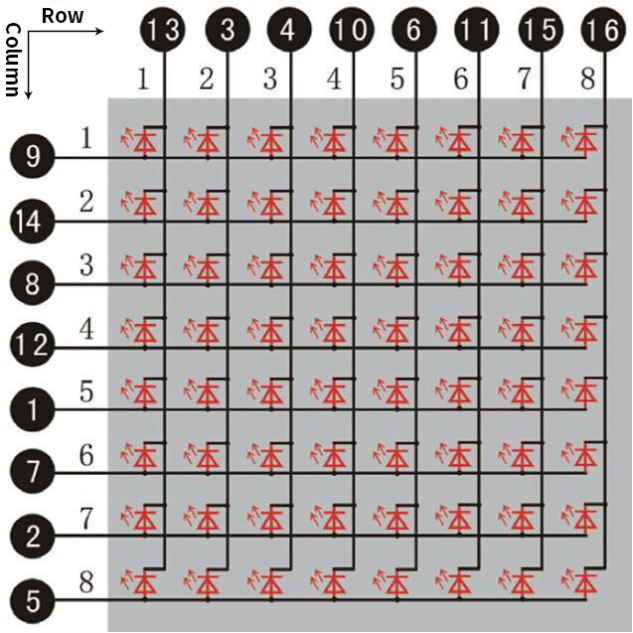
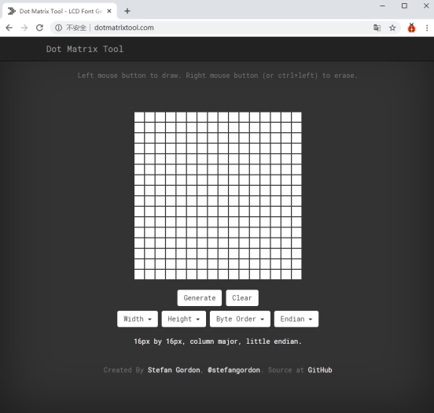
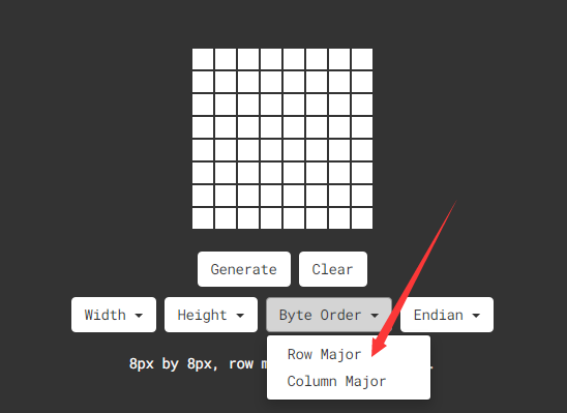
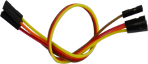
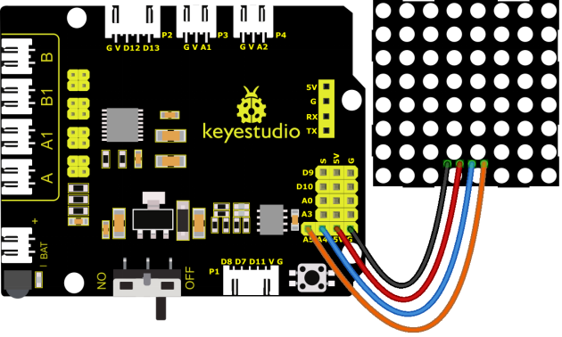
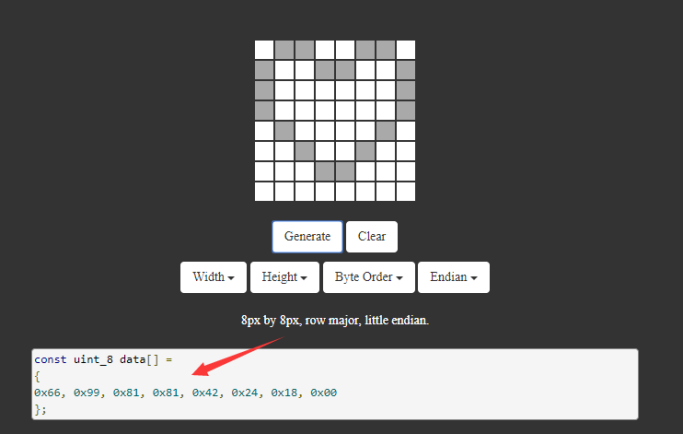

### 4.3.9 8*8 Dot Matrix

#### 4.3.9.1 Introduction

A fun way to make a small display is to use an 8x8 matrix or a 4-digit 7-segment display. Matrices like these are 'multiplexed' - to control 64 LEDs you need 16 pins. That's a lot of pins, and there are driver chips like the MAX7219 that can control a matrix for you. But there's a lot of wiring to set up and they take up a ton of space. After all, wouldn't it be awesome if you could control a matrix without tons of wiring? 
We control and drive an 8*8 LED board by the HT16K33 chip, which is convenient for wiring and greatly save the resources of microcontroller.

#### 4.3.9.2 Component Knowledge


Composed of LED emitting tube diodes, LED dot matrix are applied widely to public information display like advertisement screen and bulletin board, by controlling LED to show words, pictures and videos, etc.


Divided into single-color, double-color, and three-color lights according to emitting color , LED dot matrix could show red, yellow, green and even true color. 
There are different types of matrices, including 4×4, 8×8 and 16×16 and etc.
The 8×8 dot matrix contains 64 LEDs.
The inner structure of 8×8 dot matrix is shown below.


Every LED is installed on the cross point of row line and column line. When the voltage on a row line increases, and the voltage on the column line reduces, the LED on the cross point will light up. 8×8 dot matrix has 16 pins. Put the silk-screened side down and the numbers are 1,8, 9 and 16 in anticlockwise order as marked below.


The definition inner pins are shown below: 



For instance, to light up the LED on row 1 and column 1, you should increase the voltage of pin 9 and reduce the voltage of pin 13.

**HT16K33 8X8 Dot Matrix**

The HT16K33 is a memory mapping and multi-purpose LED controller driver. The max. Display segment numbers in the device is 128 patterns (16 segments and 8 commons) with a 13*3 (MAX.) matrix key scan circuit. The software configuration features of the HT16K33 makes it suitable for multiple LED applications including LED modules and display subsystems. The HT16K33 is compatible with most microcontrollers and communicates via a two-line bidirectional I2C-bus.
The picture below is the working schematic of HT16K33 chip


We design the drive module of 8*8 dot matrix based on the above principle. We could control the dot matrix by I2C communication and two pins of microcontroller, according to the above diagram.

**Specification of 8*8 dot matrix**

- Input voltage: 5V    
- Rated input frequency: 400KHZ 
- Input power: 2.5W  
- Input current: 500mA  

**Introduction for Modulus Tool**

The online version of dot matrix modulus tool:

[http://dotmatrixtool.com/#](http://dotmatrixtool.com/#)

① Open the link to enter the following page.



② The dot matrix is 8*8 in this project, so set the height to 8, width to 8, as shown below.


Click <span style="color: rgb(255, 76, 65);">Byte order</span> to select“**Row major**”



③ Generate hexadecimal data from the pattern

As shown below, the left button of the mouse is for selection while the right is for canceling. Thus you could use them to draw the pattern you want, then click **Generate**, to yield the hexadecimal data needed.


The generated hexadecimal code(0x00, 0x66, 0x00, 0x00, 0x18, 0x42, 0x3c, 0x00) is what will be displayed, so you need to save it for next procedure.

#### 4.3.9.3 Components

| Keyestudio 4.0 development board *1 | Keyestudio 8833 motor driver expansion board *1 | 8*8 Dot Matrix Module*1 |
| :--: | :--: | :--: |
| | | |
|F-F Dupont Wire*4|USB cable*1| |
||| |


#### 4.3.9.4 Wiring Diagram

GND, VCC, SDA and SCL of the 8*8 dot matrix module are connected to G（GND), V（VCC), A4 and A5 of the expansion board.

⚠️ **Attention: You do not need to disassemble the Smart Little Turtle Robot and re-connect the module. Here this disgram will be convenient for you to program and write code.**



#### 4.3.9.5 Test Code


```c++
/*
 keyestudio smart turtle robot
 lesson 9.1
 Matrix
 http://www.keyestudio.com
*/ 
#include <Matrix.h>
Matrix myMatrix(A4,A5);    //set pins to communication pins
// define an array
uint8_t LedArray1[8]={0x00, 0x66, 0x00, 0x00, 0x18, 0x42, 0x3c, 0x00};  
uint8_t  LEDArray[8]; //define an array(by modulus tool) without initial value

void setup(){
  myMatrix.begin(0x70);  //communication address
  myMatrix.clear();    //clear matrix
}

void loop(){
  for(int i=0; i<8; i++)  // there is eight data, loop for eight times
  {
LEDArray[i]=LedArray1[i];  //Call the emoticon array data in the subroutine LEDArray
for(int j=7; j>=0; j--)  //Every data(byte) has 8 bit, therefore, loop for eight times
    {
      if((LEDArray[i]&0x01)>0) //judge if the last bit of data is greater than 0
      {
        myMatrix.drawPixel(j, i,1);  //light up the corresponding point
      }
      else  //otherwise
      {
        myMatrix.drawPixel(j, i,0);  //turn off the corresponding point
      }
      LEDArray[i] = LEDArray[i]>>1;  //LEDArray[i] moves right for one bit to judge the previous one bit
    }
  }
  myMatrix.writeDisplay();  // dot matrix shows
}
```

#### 4.3.9.6 Test Result

When uploading the code, power up the 4.0 board and turning on the robot car, the 8*8 dot matrix shows a smile facial pattern.


#### 4.3.9.7 Extension Practice

Let’s make dot matrix draw a heart-shaped pattern. What you need to do is entering the website and drawing the following pattern.

[http://dotmatrixtool.com/#](http://dotmatrixtool.com/#)


Then we get the code of drawing the heart-shaped pattern.



Replace the above code of heart-shaped pattern, then the complete code is shown below:

```C
/*
 keyestudio smart turtle robot
 lesson 9.2
 Matrix
 http://www.keyestudio.com
*/ 
#include <Matrix.h>
Matrix myMatrix(A4,A5);    //set pins to communication pins
//define an array
uint8_t LedArray1[8]={0x66,0x99,0x81,0x81,0x42,0x24,0x18,0x00};  
uint8_t  LEDArray[8]; //define an array(by modulus tool) without initial value
void setup(){
  myMatrix.begin(0x70);  //communication address
  myMatrix.clear();    //Clear
}
void loop(){
  for(int i=0; i<8; i++)  // there is eight data, loop for eight times
  {
    LEDArray[i]=LedArray1[i];  //Call the emoticon array data in the subroutine LEDArray
    for(int j=7; j>=0; j--)  //Every data(byte) has 8 bits, therefore, loop for eight times

    {
      if((LEDArray[i]&0x01)>0) //judge if the last bit of data is greater than 0
      {
        myMatrix.drawPixel(j, i,1);  //light up the corresponding point
      }
      else  //otherwise
      {
        myMatrix.drawPixel(j, i,0);  //turn off the corresponding point 
      }
      LEDArray[i] = LEDArray[i]>>1;  //LEDArray[i] moves right for one bit to judge the previous one bit
    }
  }
  myMatrix.writeDisplay();  // dot matrix shows
}
```

Upload the code, power up the 4.0 board with a USB cable. The 8X8 module will show the heartbeat pattern.


