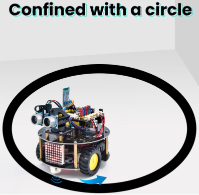
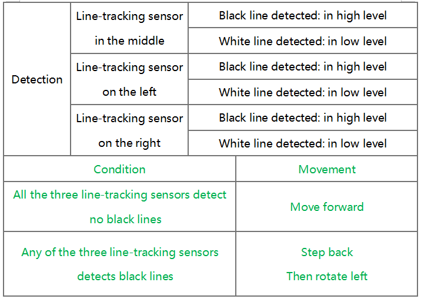
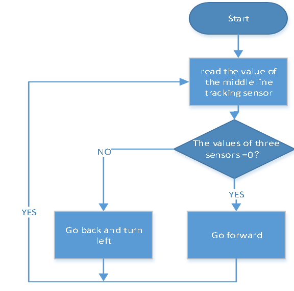

### 4.3.10 Move-in-Confined-Space car

#### 4.3.10.1 Introduction



The ultrasonic sound-following and obstacle avoidance functions of the smart car have been introduced in previous projects. Here we intend to combine the knowledge in the previous courses to confine the smart car to  move in a certain space. In the experiment, we use the line-tracking sensor to detect whether there is a black line around the smart car, and then control the rotation of the two motors according to the detection results, so as to lock the smart car in a circle drawn in black line.
 
The specific logic of the line-tracking smart car is shown in the table





#### 4.3.10.2  Wiring Diagram

G, V, S1, S2 and S3 of the line tracking sensor are connected to G（GND), V（VCC), D11, D7 and D8 of the sensor expansion board.

The power is connected to the BAT port

⚠️ **Attention: You do not need to disassemble the Smart Little Turtle Robot and re-connect the module. Here this disgram will be convenient for you to program and write code.**


#### 4.3.10.3 Test Code

```c++
/*
 keyestudio smart turtle robot
 lesson 10
 Move in Confined Space turtle
 http://www.keyestudio.com
*/ 
int left_ctrl = 4;//define direction control pin of A motor
 int left_pwm = 6;//define PWM control pin of A motor
 int right_ctrl = 2;//define direction control pin of B motor
 int right_pwm = 5;//define PWM control pin of B motor
 int sensor_L = 11;//define the pin of left line tracking sensor
 int sensor_M = 7;//define the pin of middle line tracking sensor
 int sensor_R = 8;//define the pin of right line tracking sensor
int L_val,M_val,R_val;//define these variables

void setup() {
  Serial.begin(9600);//start serial monitor and set baud rate to 9600
  pinMode(left_ctrl,OUTPUT);//set direction control pin of A motor to OUTPUT
  pinMode(left_pwm,OUTPUT);//set PWM control pin of A motor to OUTPUT
  pinMode(right_ctrl,OUTPUT);//set direction control pin of B motor to OUTPUT
  pinMode(right_pwm,OUTPUT);//set PWM control pin of B motor to OUTPUT
  pinMode(sensor_L,INPUT);//set the pins of left line tracking sensor to INPUT
  pinMode(sensor_M,INPUT);//set the pins of middle line tracking sensor to INPUT
  pinMode(sensor_R,INPUT);//set the pins of right line tracking sensor to INPUT
}

void loop() 
{
  tracking(); //run main program
}

void tracking()
{
  L_val = digitalRead(sensor_L);//read the value of left line tracking sensor
  M_val = digitalRead(sensor_M);//read the value of middle line tracking sensor
  R_val = digitalRead(sensor_R);//read the value of right line tracking sensor
  if ( L_val == 0 && M_val == 0 && R_val == 0 ) { //when no black lines are detected，turtle car forward
    Car_front();
  }
  else { //Otherwise, if any of the patrol sensors detect a black line, back up and turn left
    Car_back();
    delay(700);
    Car_left();
    delay(800);
  }
}

void Car_front()
{
  digitalWrite(left_ctrl, HIGH);
  analogWrite(left_pwm, 100);
  digitalWrite(right_ctrl, HIGH);
  analogWrite(right_pwm, 100);
}
void Car_back()
{
  digitalWrite(left_ctrl, LOW);
  analogWrite(left_pwm, 155);
  digitalWrite(right_ctrl, LOW);
  analogWrite(right_pwm, 155);
}
void Car_left()
{
  digitalWrite(left_ctrl, LOW);
  analogWrite(left_pwm, 155);
  digitalWrite(right_ctrl, HIGH);
  analogWrite(right_pwm, 100);
}
void Car_right()
{
  digitalWrite(left_ctrl, HIGH);
  analogWrite(left_pwm, 100);  
  digitalWrite(right_ctrl, LOW);
  analogWrite(right_pwm, 155);
}
void Car_Stop()
{
  digitalWrite(left_ctrl, LOW);
  analogWrite(left_pwm, 0);
  digitalWrite(right_ctrl, LOW);
  analogWrite(right_pwm, 0);
}
```

#### 4.3.10.4 Test Result

Upload the code to the development board, power up and turn the DIP switch to ON. The turtle car will move in the circle.