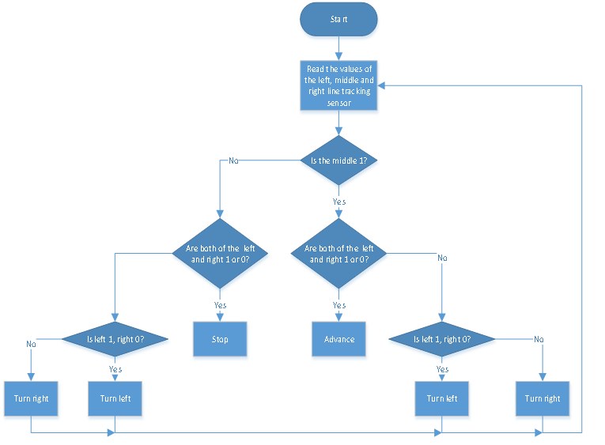
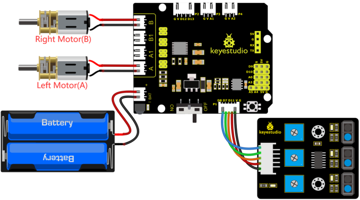

### 4.3.11 Line Tracking Robot

#### 4.3.11.1 Introduction


The previous projects are inclusive of the knowledge of multiple sensors and modules. Next, we will work on a little challenging task.
Built on the working principle of the line tracking sensor we could make a





#### 4.3.11.2 Wiring Diagram


G, V, S1, S2 and S3 of the line tracking sensor are connected to G（GND), V（VCC), D11, D7 and D8 of the sensor expansion board.

The power is connected to the BAT port

⚠️ **Attention: You do not need to disassemble the Smart Little Turtle Robot and re-connect the module. Here this disgram will be convenient for you to program and write code.**




#### 4.3.11.3 Test Code


```c++
/*
 keyestudio smart turtle robot
 lesson 11
 Tracking turtle
 http://www.keyestudio.com
*/ 
int left_ctrl = 4;//define direction control pin of A motor
 int left_pwm = 6;//define PWM control pin of A motor
 int right_ctrl = 2;//define direction control pin of B motor
 int right_pwm = 5;//define PWM control pin of B motor
 int sensor_L = 11;//define the pin of left line tracking sensor
 int sensor_M = 7;//define the pin of middle line tracking sensor
 int sensor_R = 8;//define the pin of right line tracking sensor
int L_val,M_val,R_val;//define these variables

void setup() {
  Serial.begin(9600);//start serial monitor and set baud rate to 9600
  pinMode(left_ctrl,OUTPUT);//set direction control pin of A motor to OUTPUT
  pinMode(left_pwm,OUTPUT);//set PWM control pin of A motor to OUTPUT
  pinMode(right_ctrl,OUTPUT);//set direction control pin of B motor to OUTPUT
  pinMode(right_pwm,OUTPUT);//set PWM control pin of B motor to OUTPUT
  pinMode(sensor_L,INPUT);//set the pins of left line tracking sensor to INPUT
  pinMode(sensor_M,INPUT);//set the pins of middle line tracking sensor to INPUT
  pinMode(sensor_R,INPUT);//set the pins of right line tracking sensor to INPUT
}

void loop() 
{
  tracking(); //run main program
}

void tracking()
{
  L_val = digitalRead(sensor_L);//read the value of left line tracking sensor
  M_val = digitalRead(sensor_M);//read the value of middle line tracking sensor
  R_val = digitalRead(sensor_R);//read the value of right line tracking sensor

  if(M_val == 1){//if the state of middle one is 1, which means detecting black line

     if (L_val == 1 && R_val == 0) { //If a black line is detected on the left, but not on the right, turn left
        left();
    }
     else if (L_val == 0 && R_val == 1) { //Otherwise, if a black line is detected on the right and not on the left, turn right
      right();
    }
     else { //Otherwise,forward
      front();
    }
  }
  else { //No black lines detected in the middle
    if (L_val == 1 && R_val == 0) { //If a black line is detected on the left, but not on the right, turn left
      left();
    }
    else if (L_val == 0 && R_val == 1) { //Otherwise, if a black line is detected on the right and not on the left, turn right
      right();
    }
    else { //Otherwise,stop
      Stop();
    }
  }
}
void front()//define the status of going forward
{
  digitalWrite(left_ctrl,HIGH);
  analogWrite(left_pwm,100);
  digitalWrite(right_ctrl,HIGH);
  analogWrite(right_pwm,100);
}
void back()//define the state of going back
{
  digitalWrite(left_ctrl,LOW);
  analogWrite(left_pwm,155);
  digitalWrite(right_ctrl,LOW);
  analogWrite(right_pwm,155);
}
void left()//define the left-turning state
{
  digitalWrite(left_ctrl,LOW);
  analogWrite(left_pwm,155);
  digitalWrite(right_ctrl,HIGH);
  analogWrite(right_pwm,100);
}
void right()//define the right-turning state
{
  digitalWrite(left_ctrl,HIGH);
  analogWrite(left_pwm,100);
  digitalWrite(right_ctrl,LOW);
  analogWrite(right_pwm,155);
}
void Stop()//define the state of stop
{
  digitalWrite(left_ctrl, LOW);
  analogWrite(left_pwm,0);
  digitalWrite(right_ctrl, LOW);
  analogWrite(right_pwm,0);
}
```

#### 4.3.11.4 Test Result

Uploading the code to the development board, powering up and turning the DIP switch to ON. The turtle car will walk along black lines.