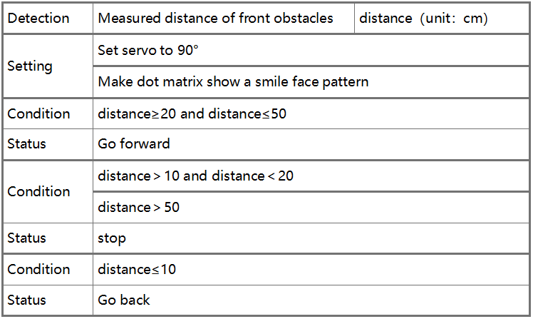
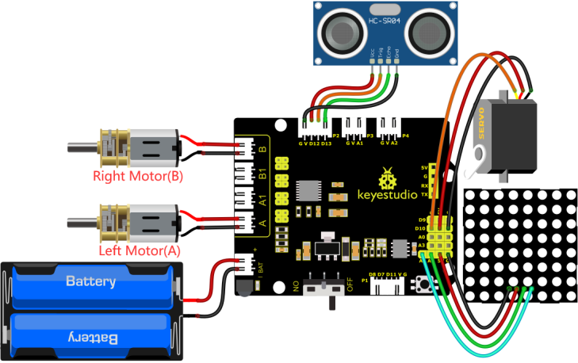

### 4.3.12  Ultrasonic Follow Robot

#### 4.3.12.1 Introduction


In this project, we detect the distance from the obstacle to drive two motors so as to make robot car move and 8*8 dot matrix shows smile facial pattern.

The specific logic of ultrasonic follow robot car is shown below:




#### 4.3.12.2 Wiring Diagram

1. GND, VCC, SDA and SCL of the 8*8 dot matrix module are connected to G（GND), V（VCC), A4 and A5 of the expansion board.
2. VCC, Trig, Echo and Gnd of the ultrasonic sensor are connected to 5V(V), D12(S), D13(S) and Gnd(G)

3. The servo is connected to G, V and D10. The brown wire is interfaced with Gnd(G), the red wire is interfaced with 5V(V) and the orange wire is interfaced with D10.
4. G, V, S1, S2 and S3 of the line tracking sensor are connected to G（GND), V（VCC), D11, D7 and D8 of the sensor expansion board.
5. The power is connected to the BAT port

⚠️ **Attention: You do not need to disassemble the Smart Little Turtle Robot and re-connect the module. Here this disgram will be convenient for you to program and write code.**



#### 4.3.12.3 Test Code

```c++
/*
 keyestudio smart turtle robot
 lesson 12
 flowing turtle
 http://www.keyestudio.com
*/ 
#include <ks_Matrix.h>
Matrix myMatrix(A4,A5);// set the pins of dot matrix to A4 and A5.
//Array, used to store the data of pattern, can be calculated by yourself or obtained from the modulus tool
uint8_t matrix_smile[8]={0x42,0xa5,0xa5,0x00,0x00,0x24,0x18,0x00};
uint8_t  LEDArray[8];

#include <Servo.h>
Servo myservo;  // create servo object to control a servo
 
#include "SR04.h" //define the function library of ultrasonic sensor
#define TRIG_PIN 12// set the signal of ultrasonic sensor to D12
#define ECHO_PIN 13// set the signal of ultrasonic sensor to D13
SR04 sr04 = SR04(ECHO_PIN,TRIG_PIN);
long distance;

int left_ctrl = 4;//define the direction control pin of A motor
int left_pwm = 6;//define the speed control pin of A motor
int right_ctrl = 2;//define the direction control pin of B motor
int right_pwm = 5;//define the speed control pin of B motor

void setup() {
  Serial.begin(9600);//open serial monitor and set baud rate to 9600
  pinMode(left_ctrl,OUTPUT);//set direction control pin of A motor to OUTPUT
  pinMode(left_pwm,OUTPUT);//set PWM control pin of A motor to OUTPUT
  pinMode(right_ctrl,OUTPUT);//set direction control pin of B motor to OUTPUT
  pinMode(right_pwm,OUTPUT);//set PWM control pin of B motor to OUTPUT
  pinMode(TRIG_PIN, OUTPUT);
  pinMode(ECHO_PIN, INPUT);
  myservo.attach(10);  // attaches the servo on pin 10 to the servo object
  myservo.write(90);
  delay(500); //waits 500ms
  myMatrix.begin(112);
  myMatrix.clear();
  myMatrix.writeDisplay();//show stop pattern
  matrix_display(matrix_smile);  //show stop pattern
  
}

void loop() {
  distance = sr04.Distance();//the distance detected by ultrasonic sensor
   if(distance <= 10)//if distance is less than 10
  {
    back();//go back
  }
  else if((distance > 10)&&(distance< 20 ))//if 10<distance<20
  {
    Stop();//stop
  }
  else if((distance >= 20)&&(distance <= 50))//if 20≤distance＜50  
{
    front();//follow
  }
  else//otherwise
  {
    Stop();//stop
  }
}

void front()//define the status of going front
{
  digitalWrite(left_ctrl,HIGH);
  analogWrite(left_pwm,100);
  digitalWrite(right_ctrl,HIGH);
  analogWrite(right_pwm,100);
}
void back()//define the status of going back
{
  digitalWrite(left_ctrl,LOW);
  analogWrite(left_pwm,150);
  digitalWrite(right_ctrl,LOW);
  analogWrite(right_pwm,150);
}
void left()//define the status of turning left
{
  digitalWrite(left_ctrl,LOW);
  analogWrite(left_pwm,100);
  digitalWrite(right_ctrl,HIGH);
  analogWrite(right_pwm,155);
}
void right()//define the status of right turning
{
  digitalWrite(left_ctrl,HIGH);
  analogWrite(left_pwm,155);
  digitalWrite(right_ctrl,LOW);
  analogWrite(right_pwm,100);
}
void Stop()//define the state of stop
{
  digitalWrite(left_ctrl, LOW);
  analogWrite(left_pwm,0);
  digitalWrite(right_ctrl, LOW);
  analogWrite(right_pwm,0);
}

//this function is used for dot matrix display
void matrix_display(unsigned char matrix_value[])
{
  for(int i=0; i<8; i++)
    {
      LEDArray[i]=matrix_value[i];
      for(int j=7; j>=0; j--)
      {
        if((LEDArray[i]&0x01)>0)
        myMatrix.drawPixel(j, i,1);
        LEDArray[i] = LEDArray[i]>>1;
      }
    } 
    myMatrix.writeDisplay();
}
```

#### 4.3.12.4 Test Result

After uploading the test code successfully, connecting according to the wiring diagram, dialing the DIP switch to the right end, powering it on, and setting the servo to 90°，the smart car will move with the obstacle and the matrix will show“smile”