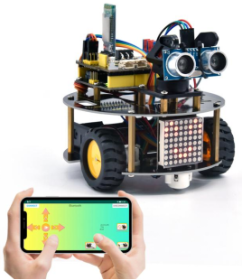
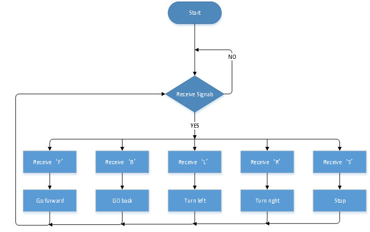

### 4.3.15 Bluetooth Control Tank 

#### 4.3.15.1 Introduction



We’ve learned the basic knowledge of Bluetooth. And in this lesson, we will make a Bluetooth remote smart car. In this experiment, we default the HM-10 Bluetooth module as a Slave and the cellphone as a Host. 
keyes BT car is an APP rolled out by keyestudio team. You can control the robot car by it readily.

#### 4.3.15.2 Download and install APP

⚠️  <span style="color: rgb(255, 76, 65);">**Note: If the APP has already been downloaded and installed before, this step can be skipped directly.**</span>

1. Visit www.keyestudio.com


2. Find “**WiKi**”，and then click "**Docs Tutorials**".


3. Click “**Download_Center**” to find the APP.


**4. Android**

Find “**Turtle Car**” (<span style="color: rgb(255, 76, 65);">**allow APP to access“location”, you could enable “location”in settings of your cellphone**</span>).


Download **Turtle Car.apk**.


Next, follow the instructions to install the app. The app icon is shown below after installation.


Click app to enter the following page.


**5. IOS**

Find “**keyes BT Car**” (<span style="color: rgb(255, 76, 65);">**allow APP to access“location”, you could enable “location”in settings of your cellphone**</span>).


Click **Jump to the App Store** to navigate to the App Store.


Search for "**keyes BT car**" directly in the App Store.


After installation, enter its interface.


Click “**Connect**” to search and pair Bluetooth. 


Click  to enter the main page of turtle smart car.


#### 4.3.15.3 Wiring Diagram

1. RXD, TXD, GND and VCC of the BT module are connected to TX, RX, G（GND) and 5V（VCC).
STATE and BRK of the BT module don’t need connection.

2.  GND, VCC, SDA and SCL of the 8*8 dot matrix module are connected to G（GND), V（VCC), A4 and A5 of the expansion board.

3. The power is connected to the BAT port

⚠️ **Attention: You do not need to disassemble the Smart Little Turtle Robot and re-connect the module. Here this disgram will be convenient for you to program and write code.**


⚠️  <span style="color: rgb(255, 76, 65);">**Note: Remove the BT module when you are uploading the code, otherwise you will fail to upload it.**</span>

#### 4.3.15.4 APP interface


#### 4.3.15.5 Flow Chart




#### 4.3.15.6 Test Code

⚠️  <span style="color: rgb(255, 76, 65);">**Note: Remove the BT module when you are uploading the code, otherwise you will fail to upload it.**</span>

```c++
/*
keyestudio smart turtle robot 
lesson 15
Bluetooth Control turtle
http://www.keyestudio.com
*/ 
#include <ks_Matrix.h>
Matrix myMatrix(A4,A5);
//Array, used to store the data of pattern, can be calculated by yourself or obtained from the modulus tool
uint8_t matrix_heart[8]={0x66,0x99,0x81,0x81,0x42,0x24,0x18,0x00};
uint8_t matrix_smile[8]={0x42,0xa5,0xa5,0x00,0x00,0x24,0x18,0x00};
uint8_t matrix_front2[8]={0x18,0x24,0x42,0x99,0x24,0x42,0x81,0x00};
uint8_t matrix_back2[8]={0x00,0x81,0x42,0x24,0x99,0x42,0x24,0x18};
uint8_t matrix_left2[8]={0x12,0x24,0x48,0x90,0x90,0x48,0x24,0x12};
uint8_t matrix_right2[8]={0x48,0x24,0x12,0x09,0x09,0x12,0x24,0x48};
uint8_t matrix_stop2[8]={0x18,0x18,0x18,0x18,0x18,0x00,0x18,0x18};
uint8_t  LEDArray[8];
unsigned char data_line = 0;
unsigned char delay_count = 0;
const int left_ctrl = 4;//define direction control pin of A motor
const int left_pwm = 6;//define PWM control pin of A motor
const int right_ctrl = 2;//define direction control pin of B motor
const int right_pwm = 5;//define PWM control pin of B motor
char BLE_val;
void setup() 
{
  Serial.begin(9600);
  pinMode(left_ctrl,OUTPUT);
  pinMode(left_pwm,OUTPUT);
  pinMode(right_ctrl,OUTPUT);
  pinMode(right_pwm,OUTPUT);
  myMatrix.begin(112);
  myMatrix.clear();
  myMatrix.writeDisplay();
  matrix_display(matrix_smile); 
}

void loop() 
{
  if(Serial.available()>0)
  {
    BLE_val = Serial.read();
    Serial.println(BLE_val);
  }
  switch(BLE_val)
  {
    case 'F': car_front();
    myMatrix.clear();
    myMatrix.writeDisplay();
    matrix_display(matrix_front2); 
    break;
    
    case 'B': car_back();
    myMatrix.clear();
    myMatrix.writeDisplay();
    matrix_display(matrix_back2); 
    break;
    
    case 'L': car_left(); 
    myMatrix.clear();
    myMatrix.writeDisplay();
    matrix_display(matrix_left2); 
    break;
    
    case 'R': car_right();
    myMatrix.clear();
    myMatrix.writeDisplay();
    matrix_display(matrix_right2); 
    break;
   
    case 'S': car_Stop();
    myMatrix.clear();
    myMatrix.writeDisplay();
    matrix_display(matrix_stop2); 
    break;
  }

}
void car_front()//go front
{
  digitalWrite(left_ctrl,HIGH);
  analogWrite(left_pwm,155);
  digitalWrite(right_ctrl,HIGH);
  analogWrite(right_pwm,155);
}
void car_back()//go backward
{
  digitalWrite(left_ctrl,LOW);
  analogWrite(left_pwm,100);
  digitalWrite(right_ctrl,LOW);
  analogWrite(right_pwm,100);
}
void car_left()//turn left
{
  digitalWrite(left_ctrl,LOW);
  analogWrite(left_pwm,100);
  digitalWrite(right_ctrl,HIGH);
  analogWrite(right_pwm,155);
}
void car_right()//turn right
{
  digitalWrite(left_ctrl,HIGH);
  analogWrite(left_pwm,155);
  digitalWrite(right_ctrl,LOW);
  analogWrite(right_pwm,100);
}

void car_Stop()//stop
{
  digitalWrite(left_ctrl,LOW);
  analogWrite(left_pwm,0);
  digitalWrite(right_ctrl,LOW);
  analogWrite(right_pwm,0);
}
// the function that dot matrix shows patterns
void matrix_display(unsigned char matrix_value[])
{
  for(int i=0; i<8; i++)
    {
      LEDArray[i]=matrix_value[i];
      for(int j=7; j>=0; j--)
      {
        if((LEDArray[i]&0x01)>0)
        myMatrix.drawPixel(j, i,1);
        LEDArray[i] = LEDArray[i]>>1;
      }
    } 
    myMatrix.writeDisplay();
}
```

#### 4.3.15.7 Test Reuslt

⚠️  <span style="color: rgb(255, 76, 65);">**Note: Remove the BT module when you are uploading the code, otherwise you will fail to upload it.  When the code uploading process is done, open the GPS on your phone, and then reconnect the Bluetooth module.**</span>

Upload the cod and power up and turn the DIP switch to ON. Inset the BT module and open your cellphone to connect Bluetooth to control the turtle car.

The turtle can move forward, backward, turn left and right and so on. Also the 8*8 module will show corresponding patterns