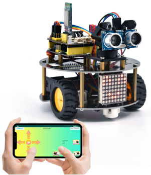
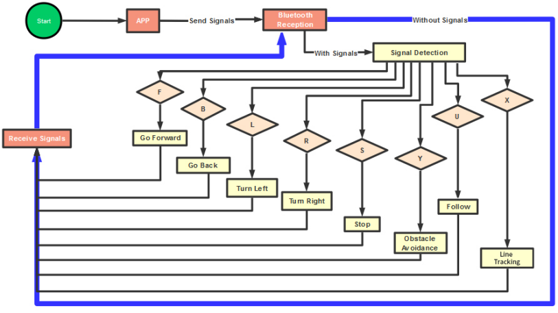
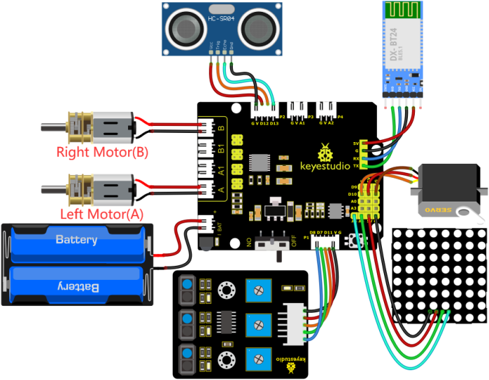

### 4.3.16 Multi-purpose Bluetooth Robot

#### 4.3.16.1 Introduction



In previous projects, the turtle robot car only performs a single function. However, in this lesson, we will integrate all of its functions via Bluetooth control.

#### 4.3.16.2 Download and install APP

⚠️  <span style="color: rgb(255, 76, 65);">**Note: If the APP has already been downloaded and installed before, this step can be skipped directly.**</span>

1. Visit www.keyestudio.com


2. Find “**WiKi**”，and then click "**Docs Tutorials**".


3. Click “**Download_Center**” to find the APP.


**4. Android**

Find “**Turtle Car**” (<span style="color: rgb(255, 76, 65);">**allow APP to access“location”, you could enable “location”in settings of your cellphone**</span>).


Download **Turtle Car.apk**.


Next, follow the instructions to install the app. The app icon is shown below after installation.


Click app to enter the following page.


**5. IOS**

Find “**keyes BT Car**” (<span style="color: rgb(255, 76, 65);">**allow APP to access“location”, you could enable “location”in settings of your cellphone**</span>).


Click **Jump to the App Store** to navigate to the App Store.


Search for "**keyes BT car**" directly in the App Store.


After installation, enter its interface.


Click “**Connect**” to search and pair Bluetooth. 


Click  to enter the main page of turtle smart car.


#### 4.3.16.3 Flow Chart



#### 4.3.16.4 Wiring Diagram

1. GND, VCC, SDA and SCL of the 8*8 dot matrix module are connected to G（GND), V（VCC), A4 and A5 of the expansion board.

2. VCC, Trig, Echo and Gnd of the ultrasonic sensor are connected to 5V(V), D12(S), D13(S) and Gnd(G)

3. The servo is connected to G, V and D10. The brown wire is interfaced with Gnd(G), the red wire is interfaced with 5V(V) and the orange wire is interfaced with D10.

4. RXD, TXD, GND and VCC of the BT module are connected to TX, RX, G（GND) and 5V（VCC).
STATE and BRK of the BT module don’t need connection.

5. Since the Keyestudio 8833 motor driver expansion board integrates the IR receiver, pins of the IR receiver are G（GND), V（VCC）and D3

6. G, V, S1, S2 and S3 of the line tracking sensor are connected to G（GND), V（VCC), D11, D7 and D8 of the sensor expansion board.

7. The power is connected to the AT port

⚠️ **Attention: You do not need to disassemble the Smart Little Turtle Robot and re-connect the module. Here this disgram will be convenient for you to program and write code.**



⚠️  <span style="color: rgb(255, 76, 65);">**Note: Remove the BT module when you are uploading the code, otherwise you will fail to upload it.**</span>

#### 4.3.16.5 Test Code

⚠️  <span style="color: rgb(255, 76, 65);">**Note: Remove the BT module when you are uploading the code, otherwise you will fail to upload it. **</span>

```c++
/*
keyestudio smart turtle robot 
lesson 16
Multifunctional turtle robot 
http://www.keyestudio.com
*/ 
#include <ks_Matrix.h>
Matrix myMatrix(A4,A5);
//Array, used to store the data of pattern, can be calculated by yourself or obtained from the modulus tool
uint8_t matrix_heart[8]={0x66,0x99,0x81,0x81,0x42,0x24,0x18,0x00};
uint8_t matrix_smile[8]={0x42,0xa5,0xa5,0x00,0x00,0x24,0x18,0x00};
uint8_t matrix_front2[8]={0x18,0x24,0x42,0x99,0x24,0x42,0x81,0x00};
uint8_t matrix_back2[8]={0x00,0x81,0x42,0x24,0x99,0x42,0x24,0x18};
uint8_t matrix_left2[8]={0x12,0x24,0x48,0x90,0x90,0x48,0x24,0x12};
uint8_t matrix_right2[8]={0x48,0x24,0x12,0x09,0x09,0x12,0x24,0x48};
uint8_t matrix_stop2[8]={0x18,0x18,0x18,0x18,0x18,0x00,0x18,0x18};
uint8_t  LEDArray[8];
#include "SR04.h"
#define TRIG_PIN 12
#define ECHO_PIN 13
SR04 sr04 = SR04(ECHO_PIN,TRIG_PIN);
long distance,distance1,distance2,distance3;
const int left_ctrl = 4;
const int left_pwm = 6;
const int right_ctrl = 2;
const int right_pwm = 5;
const int sensor_l = 11;
const int sensor_c = 7;
const int sensor_r = 8;
int l_val,c_val,r_val;
const int servopin = 10;
int myangle;
int pulsewidth;
int val;
char BLE_val;

void setup() {
  Serial.begin(9600);
  //irrecv.enableIRIn(); // Start the receiver
  servopulse(servopin,90);
  pinMode(left_ctrl,OUTPUT);
  pinMode(left_pwm,OUTPUT);
  pinMode(right_ctrl,OUTPUT);
  pinMode(right_pwm,OUTPUT);
  pinMode(sensor_l,INPUT);
  pinMode(sensor_c,INPUT);
  pinMode(sensor_r,INPUT);
  myMatrix.begin(112);
  myMatrix.clear();
  myMatrix.writeDisplay();
  matrix_display(matrix_smile);
}

void loop() {
  if(Serial.available()>0)
  {
    BLE_val = Serial.read();
    Serial.println(BLE_val);
  }
  switch(BLE_val)
  {
    case 'F': car_front();
    myMatrix.clear();
    myMatrix.writeDisplay();
    matrix_display(matrix_front2); 
    break;
    case 'B': car_back();
    myMatrix.clear();
    myMatrix.writeDisplay();
    matrix_display(matrix_back2); 
    break;
    case 'L': car_left(); 
    myMatrix.clear();
    myMatrix.writeDisplay();
    matrix_display(matrix_left2); 
    break;
    case 'R': car_right();
    myMatrix.clear();
    myMatrix.writeDisplay();
    matrix_display(matrix_right2); 
    break;
   
    case 'S': car_Stop();
    myMatrix.clear();
    myMatrix.writeDisplay();
    matrix_display(matrix_stop2); 
    break;
    case 'X': tracking(); 
    break;
    case 'Y': follow_car();
    break;
    case 'U': avoid();
    break;
  }
}

void avoid()
{
  myMatrix.clear();
  myMatrix.writeDisplay();
  matrix_display(matrix_smile); 
  int track_flag = 0;
  while(track_flag == 0)
  {
    distance1=sr04.Distance();
    if((distance1 < 10)&&(distance1 != 0))
    {
      car_Stop();
      myMatrix.clear();
      myMatrix.writeDisplay();
      matrix_display(matrix_stop2); 
      delay(100);
      servopulse(servopin,180);
      delay(100);
      distance2=sr04.Distance();
      delay(100);
      servopulse(servopin,0);
      delay(100);
      distance3=sr04.Distance();
      delay(100);
      if(distance2 > distance3)
      {
        car_left();
        myMatrix.clear();
        myMatrix.writeDisplay();
        matrix_display(matrix_left2); 
        servopulse(servopin,90);
        //delay(100);
      }
      else
      {
        car_right();
        myMatrix.clear();
        myMatrix.writeDisplay();
        matrix_display(matrix_right2); 
        servopulse(servopin,90);
        //delay(100);
      }
    }
    else
    {
      car_front();
      myMatrix.clear();
      myMatrix.writeDisplay();
      matrix_display(matrix_front2); 
    }
    if(Serial.available()>0)
    {
      BLE_val = Serial.read();
      if(BLE_val == 'S')
      {
        track_flag = 1;
      }
    }
  }
}

void follow_car()
{
  servopulse(servopin,90);
  int track_flag = 0;
  while(track_flag == 0)
  {
    distance = sr04.Distance();
      if(distance<8)
    {
      car_back();
      myMatrix.clear();
      myMatrix.writeDisplay();
      matrix_display(matrix_back2); 
    }
    else if((distance>=8)&&(distance<13))
    {
      car_Stop();
      myMatrix.clear();
      myMatrix.writeDisplay();
      matrix_display(matrix_stop2); 
    }
    else if((distance>=13)&&(distance<35))
    {
      car_front();
      myMatrix.clear();
      myMatrix.writeDisplay();
      matrix_display(matrix_front2); 
    }
    else
    {
      car_Stop();
      myMatrix.clear();
      myMatrix.writeDisplay();
      matrix_display(matrix_stop2); 
    }
    if(Serial.available()>0)
    {
      BLE_val = Serial.read();
      if(BLE_val == 'S')
      {
        track_flag = 1;
      }
    }
  }
}

void servopulse(int servopin,int myangle)
{
  for(int i=0;i<20;i++)
  {
    pulsewidth = (myangle*11)+500;
    digitalWrite(servopin,HIGH);
    delayMicroseconds(pulsewidth);
    digitalWrite(servopin,LOW);
    delay(20-pulsewidth/1000);
  }
}

void tracking()
{
  myMatrix.clear();
  myMatrix.writeDisplay();
  matrix_display(matrix_smile); 
  int track_flag = 0;
  while(track_flag == 0)
  {
    l_val = digitalRead(sensor_l);
    c_val = digitalRead(sensor_c);
    r_val = digitalRead(sensor_r);
      if(c_val == 1)
    {
      car_front2();
      myMatrix.clear();
      myMatrix.writeDisplay();
      matrix_display(matrix_front2); 
    }
    else
    {
      if((l_val == 1)&&(r_val == 0))
      {
        car_left();
        myMatrix.clear();
        myMatrix.writeDisplay();
        matrix_display(matrix_left2); 
      }
      else if((l_val == 0)&&(r_val == 1))
      {
        car_right();
        myMatrix.clear();
        myMatrix.writeDisplay();
        matrix_display(matrix_right2); 
      }
      else
      {
        car_Stop();
        myMatrix.clear();
        myMatrix.writeDisplay();
        matrix_display(matrix_stop2); 
      }
    }
    if(Serial.available()>0)
    {
      BLE_val = Serial.read();
      if(BLE_val == 'S')
      {
        track_flag = 1;
      }
    } 
  }
}
void car_front()
{
  digitalWrite(left_ctrl,HIGH);
  analogWrite(left_pwm,100);
  digitalWrite(right_ctrl,HIGH);
  analogWrite(right_pwm,100);
}
void car_front2()
{
  digitalWrite(left_ctrl,HIGH);
  analogWrite(left_pwm,155);
  digitalWrite(right_ctrl,HIGH);
  analogWrite(right_pwm,155);
}
void car_back()
{
  digitalWrite(left_ctrl,LOW);
  analogWrite(left_pwm,100);
  digitalWrite(right_ctrl,LOW);
  analogWrite(right_pwm,100);
}

void car_left()
{
  digitalWrite(left_ctrl,LOW);
  analogWrite(left_pwm,155);
  digitalWrite(right_ctrl,HIGH);
  analogWrite(right_pwm,100);
}
void car_right()
{
  digitalWrite(left_ctrl,HIGH);
  analogWrite(left_pwm,100);
  digitalWrite(right_ctrl,LOW);
  analogWrite(right_pwm,155);
}
void car_Stop()
{
  digitalWrite(left_ctrl,LOW);
  analogWrite(left_pwm,0);
  digitalWrite(right_ctrl,LOW);
  analogWrite(right_pwm,0);
}


//the function that dot matrix shows patterns
void matrix_display(unsigned char matrix_value[])
{
  for(int i=0; i<8; i++)
    {
      LEDArray[i]=matrix_value[i];
      for(int j=7; j>=0; j--)
      {
        if((LEDArray[i]&0x01)>0)
        myMatrix.drawPixel(j, i,1);
        LEDArray[i] = LEDArray[i]>>1;
      }
    } 
    myMatrix.writeDisplay();
}
```

#### 4.3.16.6 Test Result

⚠️  <span style="color: rgb(255, 76, 65);">**Note: Remove the BT module when you are uploading the code, otherwise you will fail to upload it.  When the code uploading process is done, open the GPS on your phone, and then reconnect the Bluetooth module.**</span>

Upload the code to the development board, power up and turn the DIP switch to ON. Connect the APP to Bluetooth and control the turtle car via the app. Multiple functions can be achieved.