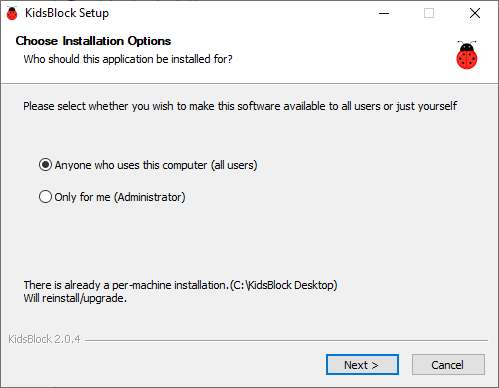
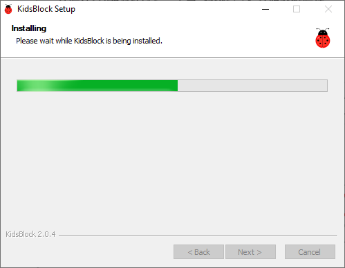
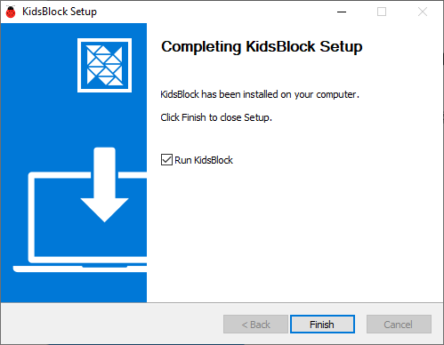
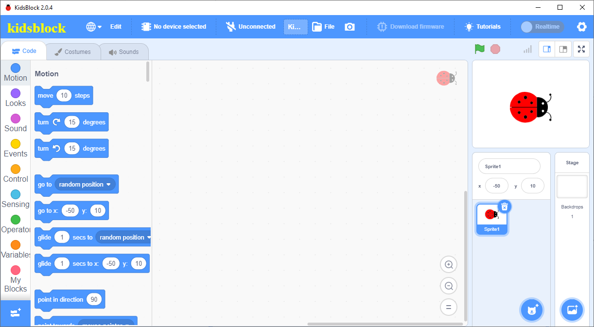
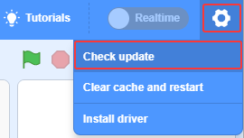
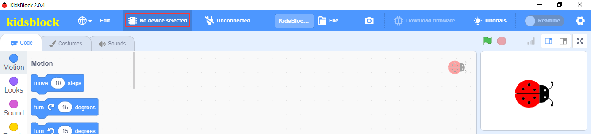
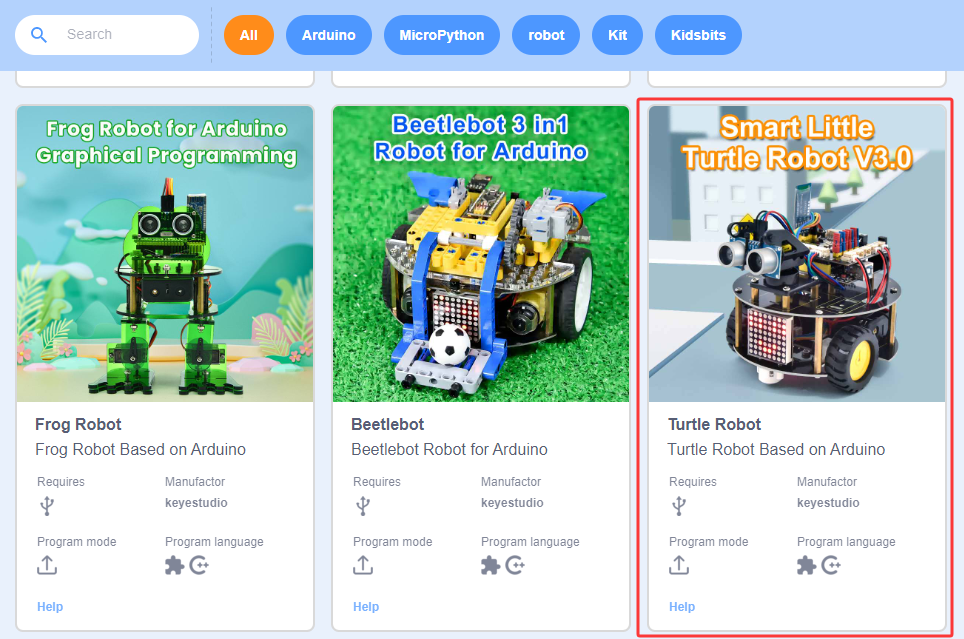
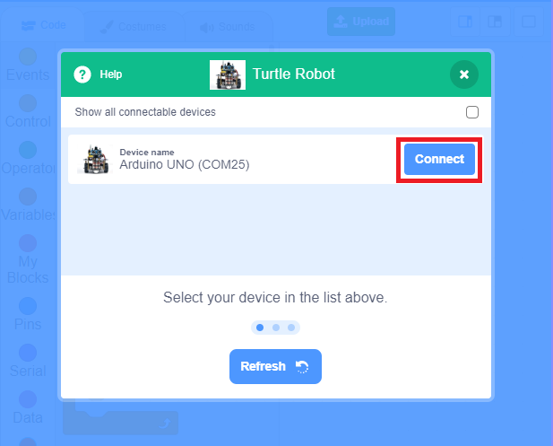
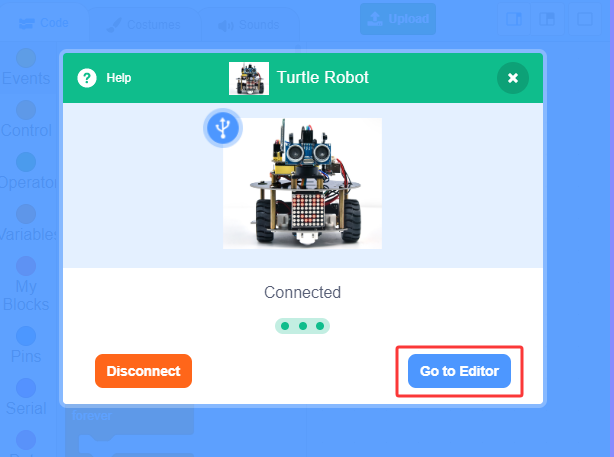
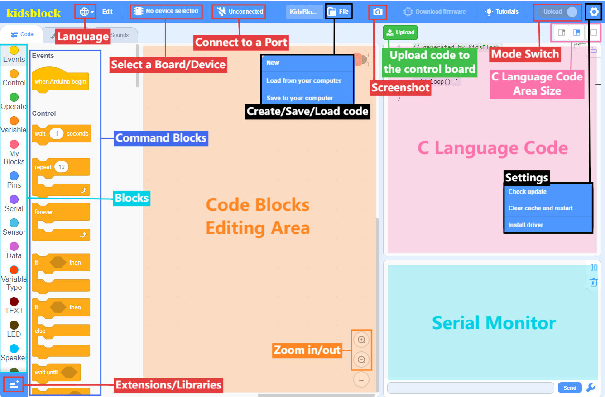

## 5.2.1 Windows

Download KidsBlock IDE on [Windows](https://xiazai.keyesrobot.cn/KidsBlock.exe).

**Install the KidsBlock IDE:**

1\. Click “**KidsBlock.exe**”: 

2\. Tick “**Anyone who uses this computer(all users)**” and click “**Next**”.

3\. Click “**Browse...**” to choose a path for the software (here we choose Disk C) and then “**Install**”.

4\. Click “Finish” and open Kidsblock.

5\. If a warning interface pops up, just “**Allow access**”. 

6\. Main interface of Kidsblock:

7\. Check update:

⚠️  **In addition to following the above steps, you can also refer to the animated demonstration in the link below.**

[https://docs.keyestudio.com/projects/KidsBlock/en/latest/docs/Kidsblock.html](https://docs.keyestudio.com/projects/KidsBlock/en/latest/docs/Kidsblock.html)

## 5.2.2 MacOS

Download KidsBlock IDE on [MacOS](https://xiazai.keyesrobot.cn/KidsBlock.dmg).

⚠️ **The installation steps of Kidsblock IDE are as follows. Please refer to the animated demonstration in the link below.**

[https://docs.keyestudio.com/projects/KidsBlock/en/latest/docs/Kidsblock.html](https://docs.keyestudio.com/projects/KidsBlock/en/latest/docs/Kidsblock.html)

## 5.2.3 Getting started with Kidsblock

⚠️ Here we demonstrate on Windows, and it can be a reference for MacOS.

### 5.2.3.1 Select a Device

1\. Connect the board to your computer via the USB cable. Click “**KidsBlock**”  to open it.

2\. Click .

3\. Select “**Turtle Robot**”.

4\. Choose the USB serial port (COM25) to Connect.

5\. Click **Go to Editor**, Back to the editor.

### 5.2.3.2 Main Interface Functions

