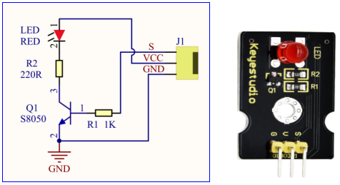
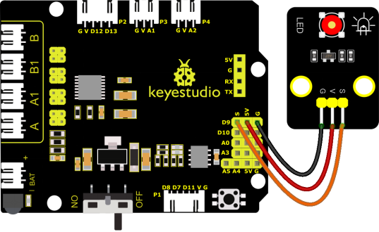
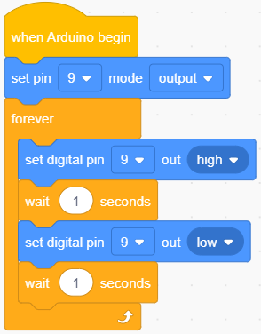
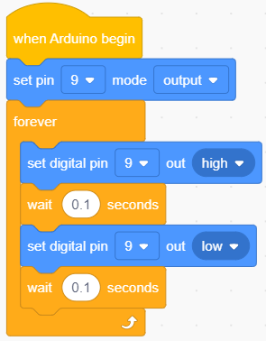

### 4.3.1 LED Blink

#### 4.3.1.1 Introduction

For starters and enthusiasts, LED Blink is a fundamental program. LED, the abbreviation of light emitting diodes, consists of Ga, As, P, N chemical compounds and so on. The LED can flash in diverse color by altering the delay time in the test code. When in control, power on GND and VCC, the LED will be on if S end is in high level; nevertheless, it will go off.

#### 4.3.1.2 Component Knowledge

**Parameters:**

- Control interface: digital port
- Working voltage: DC 3.3-5V
- Pin spacing: 2.54mm
- LED display color: red

#### 4.3.1.3 Components

| Keyestudio 4.0 development board *1 | Keyestudio 8833 motor driver expansion board *1 | Red LED Module*1 |
| :--: | :--: | :--: |
| | |  |
|3P F-F Dupont Wire*1|USB cable*1| |
||| |

#### 4.3.1.4 Wiring Diagrame

G, V and S of the LED module are connected to G, 5V and D9

⚠️ **Attention: You do not need to disassemble the Smart Little Turtle Robot and re-connect the module. Here this disgram will be convenient for you to program and write code.**

#### 4.3.1.5 Test Code

#### 4.3.1.6 Test Result

Upload the code and power up. The LED connected to D9 will blink

#### 4.3.1.7 Code Explanation

We have succeeded in blinking LED. Next, let’s observe what will happen to the LED if we modify pins and delay time.

The test result shows that the LED flashes faster. Therefore, pins and time delaying affect flash frequency. 

