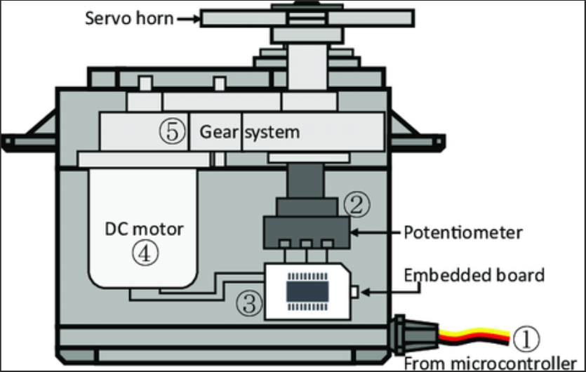
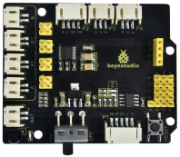
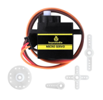
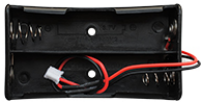
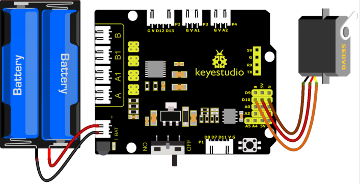
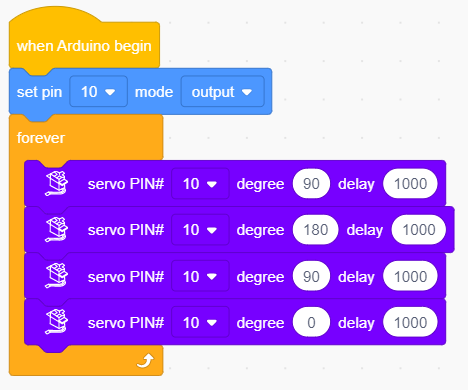

### 4.3.4 Servo Control 

#### 4.3.4.1 Introduction

Here we introduce you a servo, a type of motor that can precisely control angles and is widely used in robots, remote control models, and automation equipment. This project covers its working principle, pin functions, circuit design and how to set rotation angle by microcontroller(like ESP32). So you can program to precisely control positions and smoothly rotating. 

Through the experiment, whether you are a beginner or an electronics enthusiast, you can easily apply the servo to rotate or even collaboratively work.

#### 4.3.4.2 Component Knowledge

**Working principle**: We drive the servo via duty cycle of PWM signals. A cycle of a standard PWM is fixed to 20ms (that is, frequency is 50Hz). Theoretically, pulse width ranges within 1ms ~ 2ms. Yet in face, it is 0.5ms ~ 2.5ms, which corresponds linearly to 0° ~ 180° of the servo. The angle may vary from servos of different brands after receiving the same signal.

**Pins:**

- **GND:** ground, in brown
- **VCC:** for +5v power supply, in red
- **S:** for signal pin, PWM signal control, in orange.

**Internal structure:**

① Signal(S): It receives the control signal from microcontroller. 

② Potentiometer: the feedback part of the Servo. It measures the position of output shaft.

③ Embedded board (Internal controller): the core of the Servo. It processes external control signal and the feedback signal of position and drives the Servo. 

④ DC motor: the execution part. It outputs speed, torque and position. 

⑤ Gear system: It scales the outputs from motor to the final output Angle according to a certain transmission ratio.

**Drive the Servo:**

Signal(S) receives PWM to control the output of Servo, and **the position of output shaft directly relies on the duty cycle of PWM**. 

For instance (a 180° servo):

- If we send a signal with pulse width of 1.5ms to Servo, its shaft(horn) will revolves to the middle position(90°);
- If pulse width = `0.5ms`, the shaft turns to its minimum(0°);
- If pulse width = `2.5ms`, the shaft turns to its maximum(180°).

The period of a Servo usually lasts 20ms and it produce pulses at a frequency of `50Hz`. Most servos work normally at 40~200Hz. 

The maximum angle varies from the types of Servos. Some are 170° while some are only 90°. In spite of this, Servos usually will move a half (of the maximum) if they receive a signal with pulse width of 1.5ms.

#### 4.3.4.3 Components

| Keyestudio 4.0 development board *1 | Keyestudio 8833 motor driver expansion board *1 | Servo*1 |
| :--: | :--: | :--: |
| | | |
|18650 Battery Holder*1|USB cable*1|18650 Battery*2 |
||| |

#### 4.3.4.4 Wiring Diagram

Wiring note: the brown line of servo is linked with Gnd(G), the red one is connected to 5v(V) and the orange one is attached to digital 10.

The servo has to be connected to external power due to its high demand for driving servo current. Generally, the current of development board is not big enough. If without connected power, the development board could be burnt.

⚠️ **Attention: You do not need to disassemble the Smart Little Turtle Robot and re-connect the module. Here this disgram will be convenient for you to program and write code.**

#### 4.3.4.5 Test Code1

#### 4.3.4.6 Test Result1

Upload code and power the 4.0 board up with a USB cable, then the servo swings among 90°, 180° and 0°.
