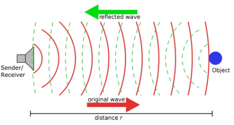
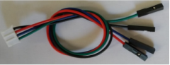
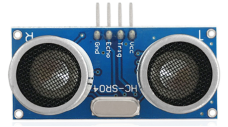
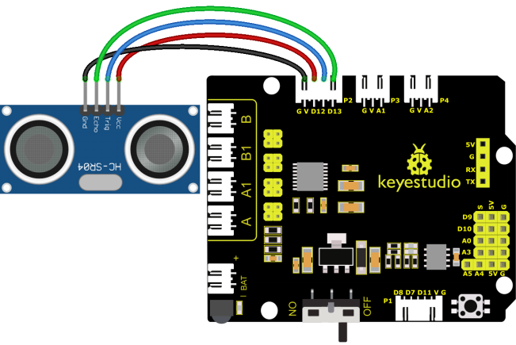
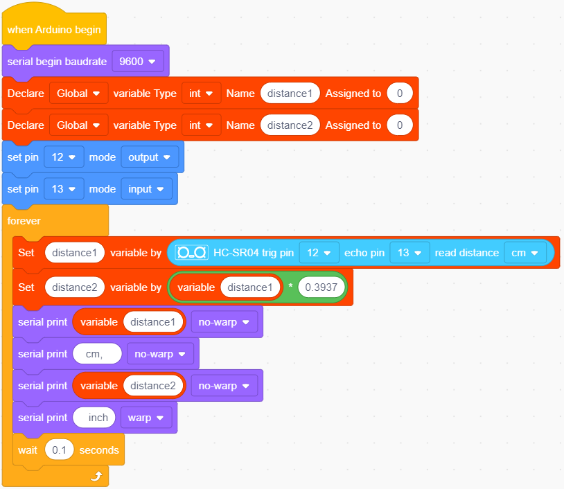
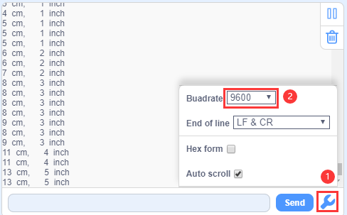
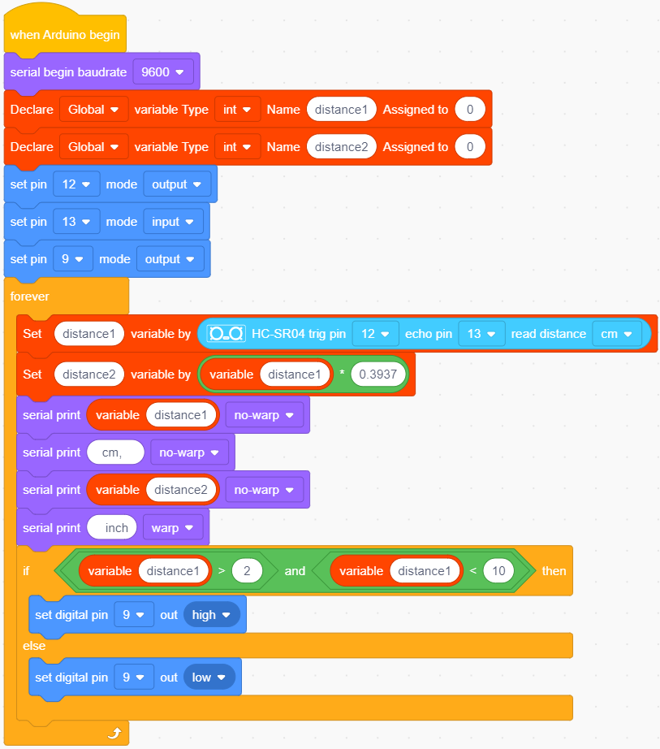

### 4.3.5 Ultrasonic Sensor 

#### 4.3.5.1 Introduction

The HC-SR04 ultrasonic sensor uses sonar to determine distance to an object like what bats do. It offers excellent non-contact range detection with high accuracy and stable readings in an easy-to-use package. It comes complete with ultrasonic transmitter and receiver modules.

The HC-SR04 or the ultrasonic sensor is being used in a wide range of electronics projects for creating obstacle detection and distance measuring application as well as various other applications. Here we have brought the simple method to measure the distance with arduino and ultrasonic sensor and how to use ultrasonic sensor with Arduino.

#### 4.3.5.2 Component Knowledge

The ultrasonic module detects obstacles. It mainly adopts CS100A chip and can be compatible with both 3.3V and 5V.

In this ultrasonic ranging system, we firstly program on MCU(ESP32 development board) to generate an original square wave and drive the ultrasonic module to emit it. Immediately, the module calculates the distance to the object after receiving the reflected wave(Echo) amplified and shaped by the circuit. Herein, it records the duration of emission and reflection and calculates the distance according to the time difference.

**Parameters:**

- Operating voltage: DC 3.3V~5V
- Static current: <2mA
- Working current: 50mA~100mA, normally 65mA
- Maximum power: 0.5W
- Maximum detection distance: 3 meters
- Blind spot: Less than 4cm
- Sensing Angle: No more than 15 degrees
- Trigger input signal: 10us TTL pulse

**Working principle:**

The most common ultrasonic ranging method is the echo detection. When a pulse voltage is triggered (MCU sends a high level to the Trig pin), the chip in the ultrasonic transmitter will vibrate to generate ultrasonic waves. As long as the emitter emits these waves towards certain direction, the counter start to count. Waves travel and reflect back once encountering an obstacle (Echo pin sends a high level to MCU). Then the counter will stop counting when the receiver receives the ultrasonic waves coming back.

The ultrasonic wave is also sound wave, and its speed of sound V is related to temperature. Generally, it travels 340m/s in the air. According to time(t), we can calculate the distance(s) from the emitting spot to the obstacle: s=340t/2.

The HC-SR04 ultrasonic sensor can detect distance of 2cm-3m without direct contact, and its accuracy can reach as high as 3mm.

The module includes an ultrasonic transmitter, receiver and control circuit. 

(1) First pull down the TRIG, and then trigger it with at least 10us high level signal;

(2) After triggering, the module will automatically transmit eight 40KHZ square waves, and automatically detect whether there is a signal to return.

(3) If there is a signal returned back, through the ECHO to output a high level, the duration time of high level is actually the time from emission to reception of ultrasonic.

(4) Distance = (high level time x speed of sound (340M/S)) / 2

⚠️ **ATTENTION:**

This module should not be powered on when connecting. If necessary, connect GND first.

The area of the object to be measured should be at least 0.5m² and as flat as possible. Otherwise, it will affect the result.

#### 4.3.5.3 Components

| Keyestudio 4.0 development board *1 | Keyestudio 8833 motor driver expansion board *1 | Red LED Module*1 |
| :--: | :--: | :--: |
| | |  |
|3P F-F Dupont Wire*1|USB cable*1|4P Dupont Wire*1 |
||||
|HC-SR04 Ultrasonic Sensor*1| | |
|| | |

#### 4.3.5.4 Wiring Diagram

VCC, Trig, Echo and Gnd of the ultrasonic sensor are connected to 5V(V), D12(S), D13(S) and Gnd(G)

⚠️ **Attention: You do not need to disassemble the Smart Little Turtle Robot and re-connect the module. Here this disgram will be convenient for you to program and write code.**

#### 4.3.5.5 Test Code

#### 4.3.5.6 Test Result

Upload test code to the development board, open serial monitor and set baud rate to 9600. The detected distance will be displayed, and the unit is cm and inch. Hinder the ultrasonic sensor by hand, the displayed distance value gets smaller.

#### 4.3.5.7 Extension Practice

We have just measured the distance displayed by the ultrasonic. How about controlling the LED with the measured distance? Let's try it and connect an LED light module to the D9 pin.

⚠️ **Attention: You do not need to disassemble the Smart Little Turtle Robot and re-connect the module. Here this disgram will be convenient for you to program and write code.**

Upload test code to development board and block ultrasonic sensor by hand, then check if LED is on

