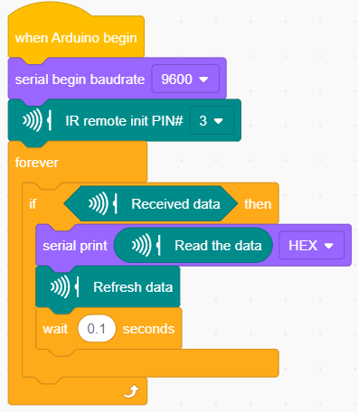
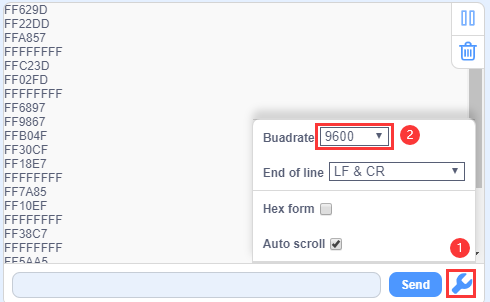
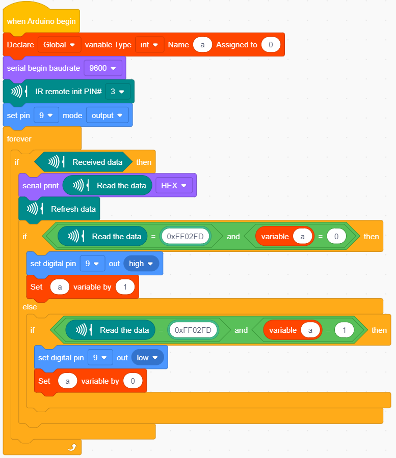

### 4.3.6 IR Reception

#### 4.3.6.1 Introduction

There is no doubt that infrared remote control is ubiquitous in daily life. It is used to control various household appliances, such as TVs, stereos, video recorders and satellite signal receivers. Infrared remote control is composed of infrared transmitting and infrared receiving systems, that is, an infrared remote control and infrared receiving module and a single-chip microcomputer capable of decoding.​ 

   
The 38K infrared carrier signal emitted by remote controller is encoded by the encoding chip in the remote controller. It is composed of a section of pilot code, user code, user inverse code, data code, and data inverse code. The time interval of the pulse is used to distinguish whether it is a 0 or 1 signal and the encoding is made up of these 0, 1 signals. 

The user code of the same remote control is constant while the data code can distinguish the key.

When the remote control button is pressed, the remote control sends out an infrared carrier signal. When the IR receiver receives the signal, the program will decode the carrier signal and determines which key is pressed. The MCU decodes the received 01 signal, thereby judging what key is pressed by the remote control.
Infrared receiver we use is an infrared receiver module. Mainly composed of an infrared receiver head, which is a device that integrates reception, amplification, and demodulation. Its internal IC has completed demodulation, and can achieve from infrared reception to output and be compatible with TTL signals. Additionally, it is suitable for infrared remote control and infrared data transmission. The infrared receiving module made by the receiver has only three pins, signal line, VCC and GND. It is very convenient to communicate with Arduino and other microcontrollers.

#### 4.3.6.2 Specification

- Operating Voltage: 3.3-5V（DC）
- Interface: 3PIN
- Output Signal: Digital signal
- Receiving Angle: 90 degrees
- Frequency: 38khz
- Receiving Distance: ＜10m

#### 4.3.6.3  Components

| Keyestudio 4.0 development board *1 | Keyestudio 8833 motor driver expansion board *1 | Red LED Module*1 |
| :--: | :--: | :--: |
| | |  |
|3P F-F Dupont Wire*1|USB cable*1| |
||| |

**Since the 8833 board integrates with the IR receiver, it doesn’t need wiring up.**

**Pins of IR receiver module are G(GND）, V（VCC）and D3.**

#### 4.3.6.4 Test Code

#### 4.3.6.5 Test Result

Upload the test code. After uploading the code successfully, use the USB cable to connect the computer to supply power to the Keyestudio 4.0 development board. After powering on, open the serial monitor, set the baud rate to 9600, take out the remote control, and send the signal to the infrared receiving sensor. You can see the key value of the corresponding key, if the key time is too long, FFFFFFFF is prone to garbled characters.

The keys value of Keyestudio remote control are shown below. 

#### 4.3.6.6 Code Explanation

**irrecv.enableIRIn()**: after enabling IR decoding, the IR signals will be received, then function“decode()”will check continuously to make ure if decoding successfully.

**irrecv.decode(&results)**: after decoding successfully, this function will come back to “true”, and keep result in “results”. After decoding a IR signals, run the resume()function and continue to receive the next signal.

#### 4.3.6.7 Code Explanation

We decoded the key value of IR remote control. How about controlling LED by the measured value? We could design an experiment.
Attach an LED to D9, then press the keys of remote control to make LED light on and off.

⚠️ **Attention: You do not need to disassemble the Smart Little Turtle Robot and re-connect the module. Here this disgram will be convenient for you to program and write code.**

Upload code to development board and power it up with a USB cable. Press the OK key on remote control to make LED on and off.
