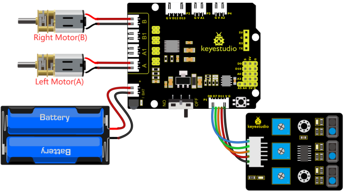
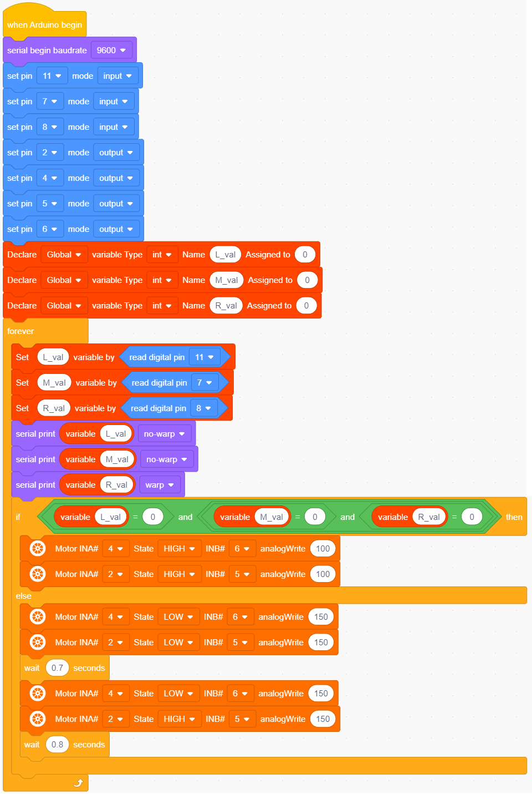

### 4.3.10 Move-in-Confined-Space car

#### 4.3.10.1 Introduction

The ultrasonic sound-following and obstacle avoidance functions of the smart car have been introduced in previous projects. Here we intend to combine the knowledge in the previous courses to confine the smart car to  move in a certain space. In the experiment, we use the line-tracking sensor to detect whether there is a black line around the smart car, and then control the rotation of the two motors according to the detection results, so as to lock the smart car in a circle drawn in black line.
 
The specific logic of the line-tracking smart car is shown in the table

#### 4.3.10.2  Wiring Diagram

G, V, S1, S2 and S3 of the line tracking sensor are connected to G（GND), V（VCC), D11, D7 and D8 of the sensor expansion board.

The power is connected to the BAT port

⚠️ **Attention: You do not need to disassemble the Smart Little Turtle Robot and re-connect the module. Here this disgram will be convenient for you to program and write code.**

#### 4.3.10.3 Test Code

#### 4.3.10.4 Test Result

Upload the code to the development board, power up and turn the DIP switch to ON. The turtle car will move in the circle.