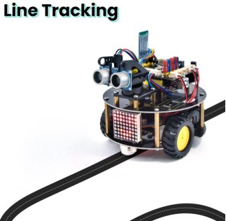
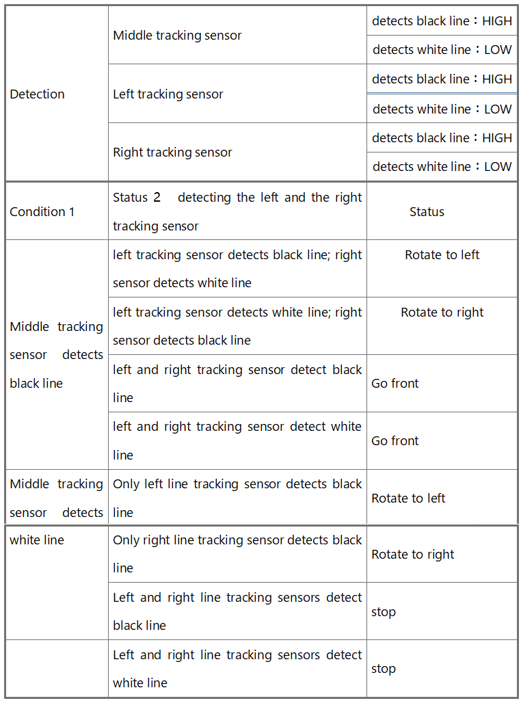
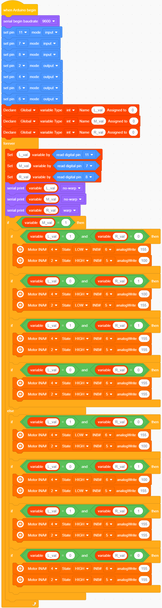

### 4.3.11 Line Tracking Robot

#### 4.3.11.1 Introduction

The previous projects are inclusive of the knowledge of multiple sensors and modules. Next, we will work on a little challenging task.
Built on the working principle of the line tracking sensor we could make a

#### 4.3.11.2 Wiring Diagram

G, V, S1, S2 and S3 of the line tracking sensor are connected to G（GND), V（VCC), D11, D7 and D8 of the sensor expansion board.

The power is connected to the BAT port

⚠️ **Attention: You do not need to disassemble the Smart Little Turtle Robot and re-connect the module. Here this disgram will be convenient for you to program and write code.**

#### 4.3.11.3 Test Code

#### 4.3.11.4 Test Result

Uploading the code to the development board, powering up and turning the DIP switch to ON. The turtle car will walk along black lines.