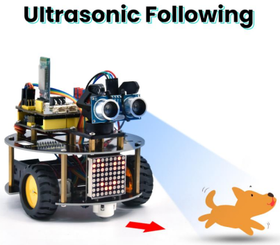
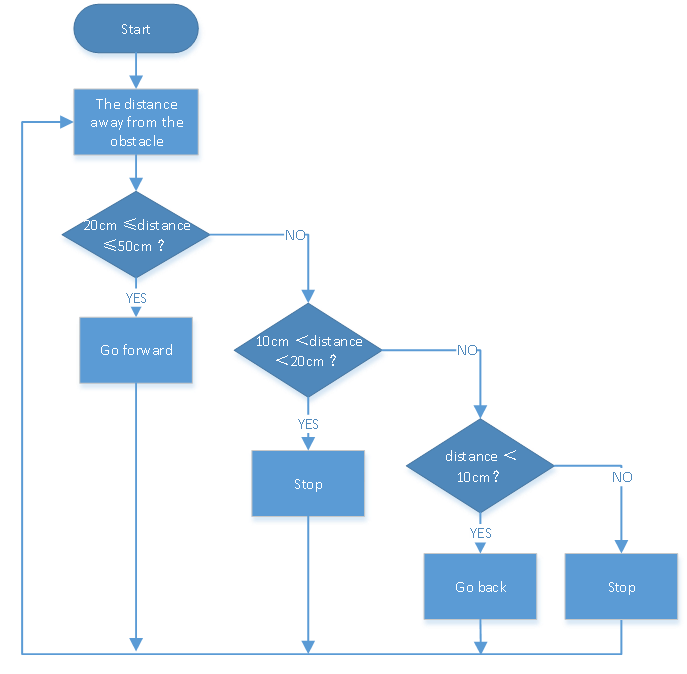
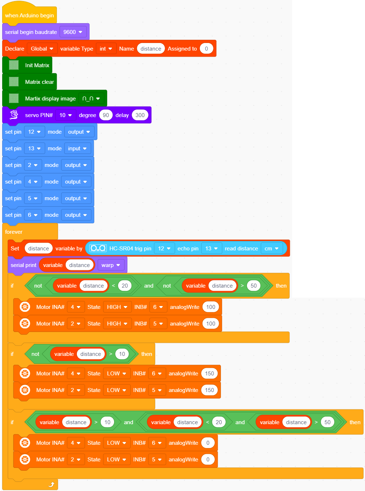

### 4.3.12  Ultrasonic Follow Robot

#### 4.3.12.1 Introduction

In this project, we detect the distance from the obstacle to drive two motors so as to make robot car move and 8*8 dot matrix shows smile facial pattern.

The specific logic of ultrasonic follow robot car is shown below:

#### 4.3.12.2 Wiring Diagram

1. GND, VCC, SDA and SCL of the 8*8 dot matrix module are connected to G（GND), V（VCC), A4 and A5 of the expansion board.
2. VCC, Trig, Echo and Gnd of the ultrasonic sensor are connected to 5V(V), D12(S), D13(S) and Gnd(G)

3. The servo is connected to G, V and D10. The brown wire is interfaced with Gnd(G), the red wire is interfaced with 5V(V) and the orange wire is interfaced with D10.
4. G, V, S1, S2 and S3 of the line tracking sensor are connected to G（GND), V（VCC), D11, D7 and D8 of the sensor expansion board.
5. The power is connected to the BAT port

⚠️ **Attention: You do not need to disassemble the Smart Little Turtle Robot and re-connect the module. Here this disgram will be convenient for you to program and write code.**

#### 4.3.12.3 Test Code

#### 4.3.12.4 Test Result

After uploading the test code successfully, connecting according to the wiring diagram, dialing the DIP switch to the right end, powering it on, and setting the servo to 90°，the smart car will move with the obstacle and the matrix will show“smile”