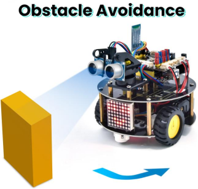
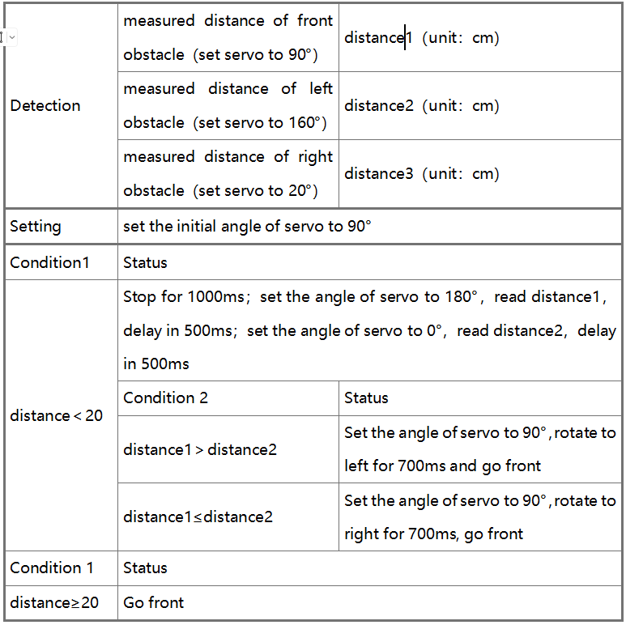
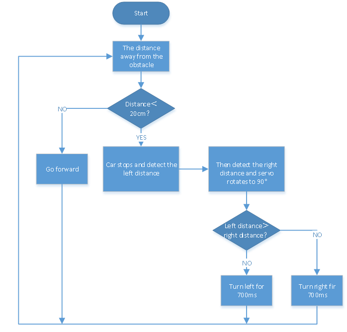
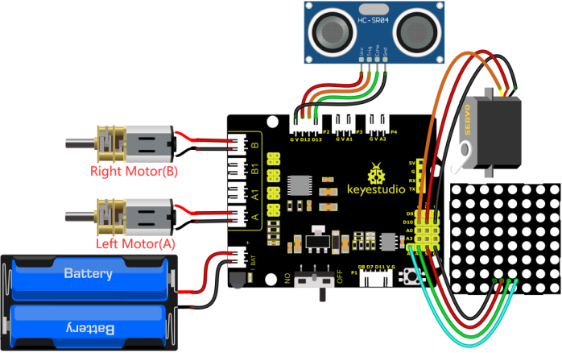
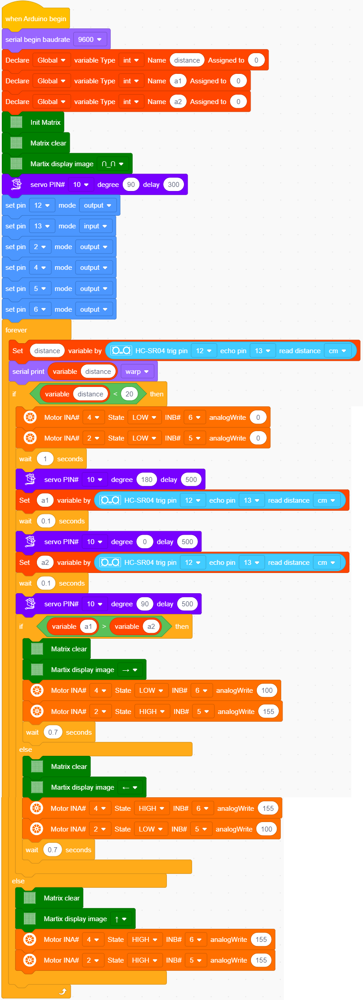

### 4.3.13 Ultrasonic Avoiding Robot

#### 4.3.13.1 Introduction

We’ve learned LED matrix, motor drive, ultrasonic sensor and servo in previous lessons. Next, we could make an ultrasonic avoiding robot! 
The measured distance between an ultrasonic sensor and obstacle can be used to control the servo to rotate so as to make robot car move.
The specific logic of ultrasonic avoiding smart car is shown below: 

#### 4.3.13.2 Wiring Diagram

1. GND, VCC, SDA and SCL of the 8*8 dot matrix module are connected to G（GND), V（VCC), A4 and A5 of the expansion board.

2. VCC, Trig, Echo and Gnd of the ultrasonic sensor are connected to 5V(V), D12(S), D13(S) and Gnd(G)

3. The servo is connected to G, V and D10. The brown wire is interfaced with Gnd(G), the red wire is interfaced with 5V(V) and the orange wire is interfaced with D10.

4. The power is connected to the BAT port

⚠️ **Attention: You do not need to disassemble the Smart Little Turtle Robot and re-connect the module. Here this disgram will be convenient for you to program and write code.**

#### 4.3.13.3 Test Code

#### 4.3.13.4 Test Result

After upload the test code successfully, power on the external power and turn the DIP switch to the ON end, the smart car moves forward and automatically avoids obstacles.
