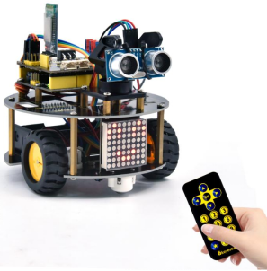
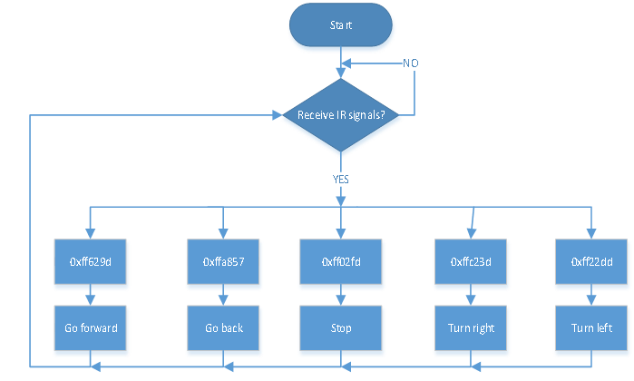
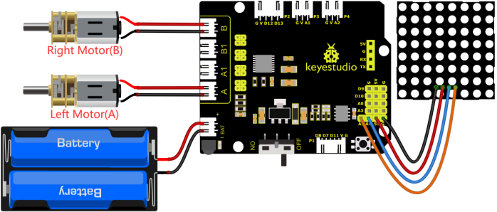
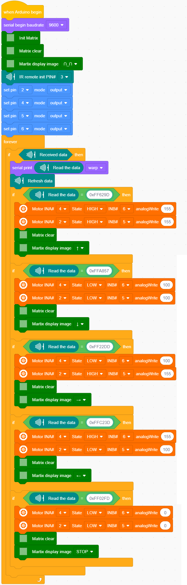

### 4.3.14 IR Remote Control Robot 

#### 4.3.14.1 Introduction

In this project, we will make IR remote control robot car!
Press the button on IR remote control to drive robot car to move, and the corresponding state pattern is displayed on the 8*16 LED matrix.

The specific logic of IR remote control robot car is shown below:

#### 4.3.14.2 Wiring Diagram

1. GND, VCC, SDA and SCL of the 8*8 dot matrix module are connected to G（GND), V（VCC), A4 and A5 of the expansion board.

2. Since the Keyestudio 8833 motor driver expansion board integrates the IR receiver, pins of the IR receiver are G（GND), V（VCC）and D3
3. The power is connected to the BAT port

⚠️ **Attention: You do not need to disassemble the Smart Little Turtle Robot and re-connect the module. Here this disgram will be convenient for you to program and write code.**

#### 4.3.14.3 Test Code

#### 4.3.14.4 Test Result

Upload code power on the external power, turn the DIP switch to ON and press buttons on IR remote control. The turtle robot car will follow the obstacle to move.
